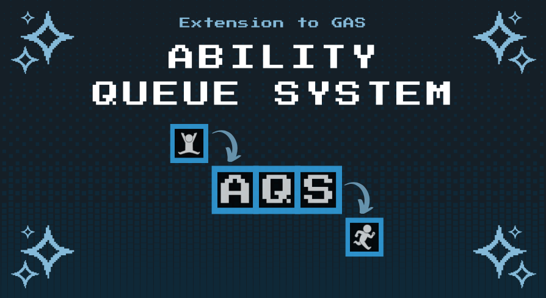

# About Ability Queue System
Ability System is a very well-structured official solution for creating gameplay interaction events. Though it is very modular, it lacks fluid transitions between actions. This plugin solves this by giving each action (in its phases) priorities and activating them accordingly, without interfering with Epic's Ability System.

 

## How does it Work?
This system uses a child of Ability System: Queueable Ability System Component. In there you populate the Ability Sets and these sets will be used for simulating press, release, cancel of inputs. When a input gets pressed system will find the corresponding Queuable Ability  and it will try to play that ability based on it's initial priority, thus creating a modular action design.

## Well Optimized
The system will attempt to activate abilities whenever a new phase is reached or a new input is added, as these are the ideal conditions for activating a new ability. This approach ensures that the system has almost no performance cost. However, you can always manually check the activation if needed.

## Discord Support
Discord is always available to ask questions, showing of, or just to saying hi! Hoping you to see there soon! (link at the bottom!)
