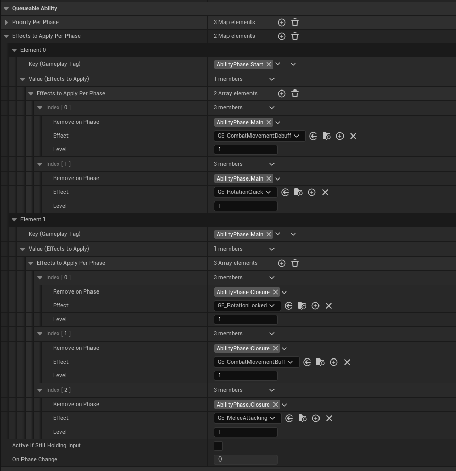

# Effects Per Phase

This section just another bonus of using Phase system. You can define which and when a Gameplay Effect will be applied and when to remove it. It is pretty straightforward but very powerful.

## Example use of Effects Per Phase

Given example is the class of **GA_MeleeAttack**. In the project I want my character to lock it's rotation while attacking and in the initial phase of the action I want the character to be stationary but fast while attacking. As you can see If this would be done in the ability event graph, this would easly cause a sphagetti blueprint but with this method it is very easy to create and edit this kind of behaviours.

As you can see in the Queueable Ability childs you have a map that you can populate in the details panel. Every element key will determine which phase the "value" effects will be applied. 
In the values you have 3 fields:
* **Remove on Phase:** the applied effect will be removed in this phase.
* **Effect:** The class of effect that will be applied.
* **Level:** This will be the level of the applied effect.

:::note
    If a ability gets removed, all the applied effects will be removed also.
:::