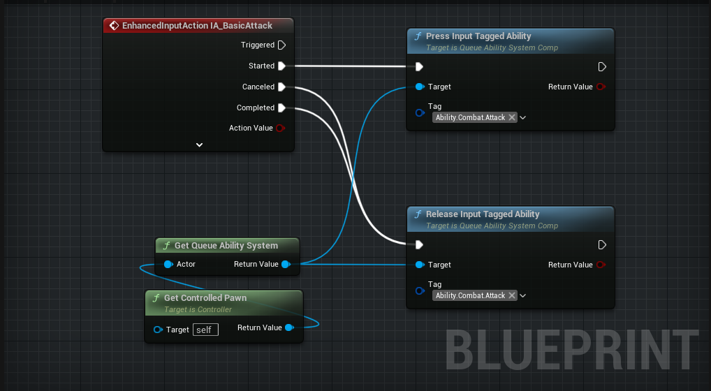
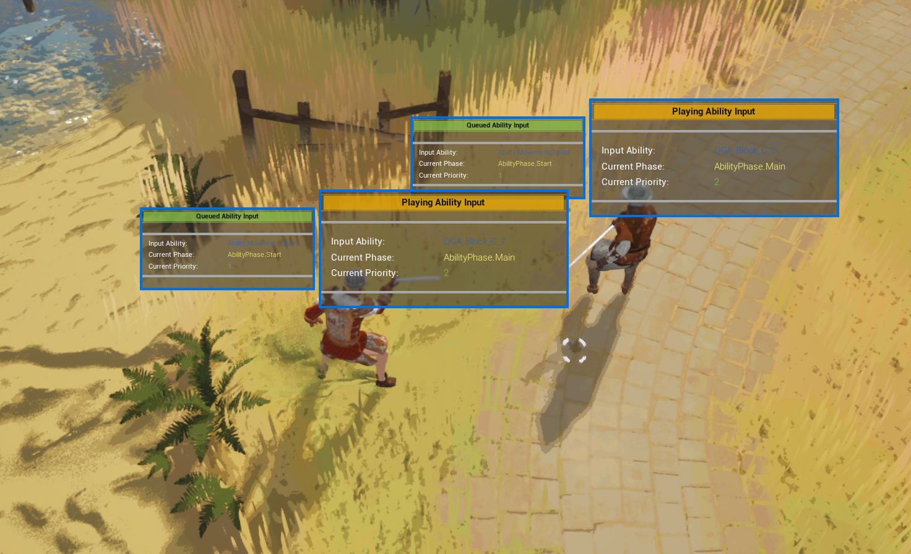

# Inputing Queueable Abilities

There are 3 functions that you can use to interact with the Queueable Abilities. PressInputTaggedAbility (Simulates the PressInputID), ReleaseInputTaggedAbility(Simulates the ReleaseInputID) and CancelInputTaggedAbility(Just cancels the tagged ability if it is active).

A convinient place to use this functions is at the PlayerController and with the enhanced input.

This way we can queue abilities with the sets we defined in our Queueable Ability Component easily!

## Debugging

If you want to debug the inputs and current ability and more, you can add widget component **WC_AbilityQueueSystem** to your actors. This widget will show the AQS's current state on the attached actor.

This is also useful for debuging AI's. You can use this queue system with your AI's and see what they are "wanting" to do. 