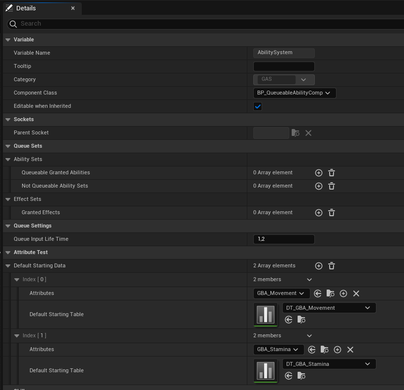
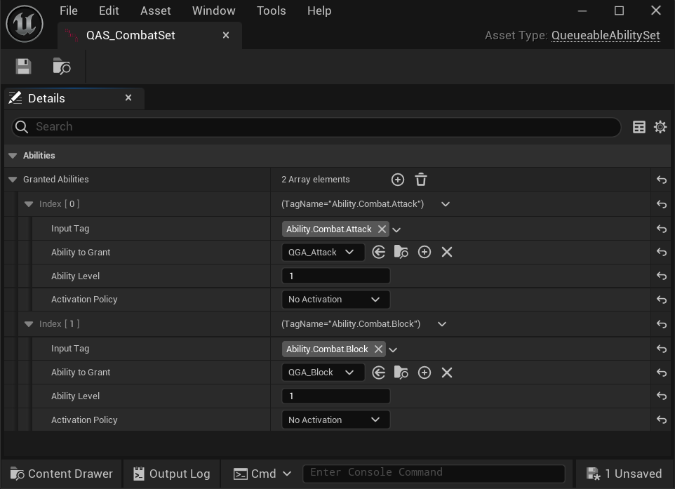
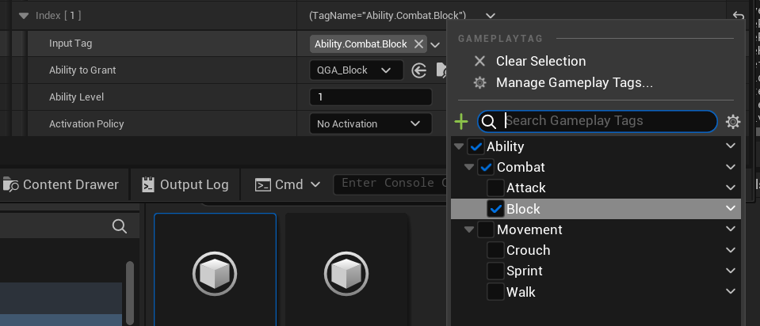
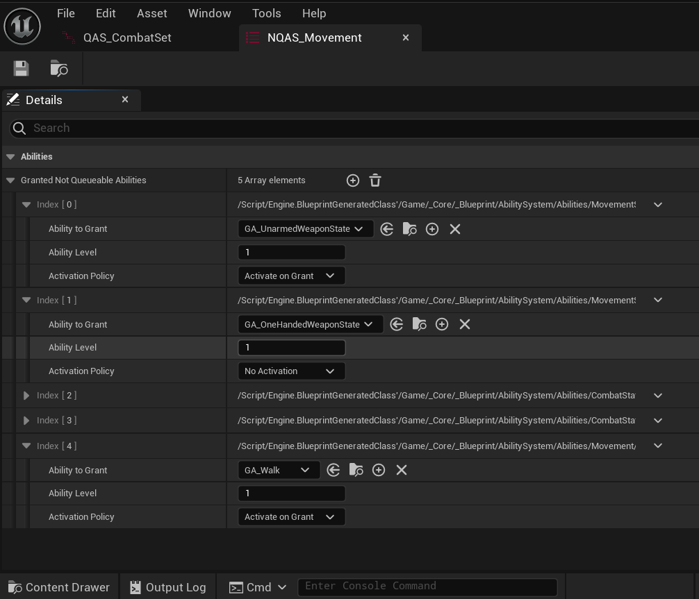
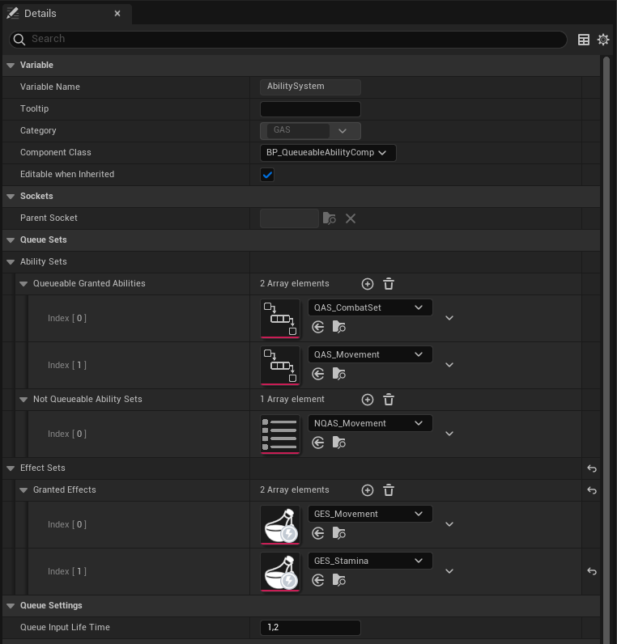

# Ability Sets

First of all you should add **Queueable Ability System Component** to your character. This can be achieved both c++ or blueprints. Or even further, you could make a child of **Queueable Ability System Component** and use it instead. After this your Details panel should look like this:

As you can see **Queue Sets** are the extension of the **Queueable Ability System Component**. There are 3 types of sets we can add here:

 * **Queueable Granted Abilities:** This abilities are bind to a gameplay tag that you can press, release input to. And system will add them to the queue and play if the system is availible. They are child of **Queueable Ability**.
 * **Not Queueable Granted Ability Sets:** This abilities are the default *Gameplay Abilities*. Given abilities will be granted  to the owner of this compoonent on begin play. After that you can use them as you would any gameplay ability.
 * **Granted Effects:** This set is just a bonus for this plugin. You can add any gameplay effects here and they will be applied to the character on begin play. 

## Queueable Ability Set:

This are [Data Assets](https://dev.epicgames.com/documentation/en-us/unreal-engine/data-assets-in-unreal-engine) that can be created like you would any data asset. In the details there is a array that you need to populate with your **Queueable Abilities**.
Final result will look like this:

Input tag will be used to give inputs to interact with this ability. Ability Level is the default Ability Level from the Gameplay Abilities. And Activation Policity can be "No Activation", "Activate On Grant" and "Activate and Deactivate on Grant". Which does what they say. This Activation policity can be usefull for looping abilities such as: Sprinting, Walking, or any stance ability. They can init some values such as walking speed, state tags etc.

:::tip
If your ability tags should start with "Ability." only child of this tags will be visible in here and while inputting abilities. Making editing abilites and inputs easier!

:::

## Notqueueable Ability Set

These are just default gameplay abilities that are granted to the owner in begin play. You can use them as you would any gameplay ability.

### After Creating Your Sets, Add Them to Your Queueable Ability System Component

:::note
    **Queue Input Life Time** will determine the life time of the input. If the input gets initialized and does not get used for this second, input will destroy if itself.
:::