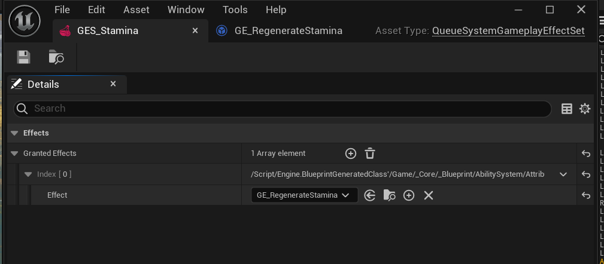
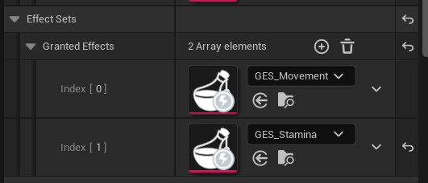
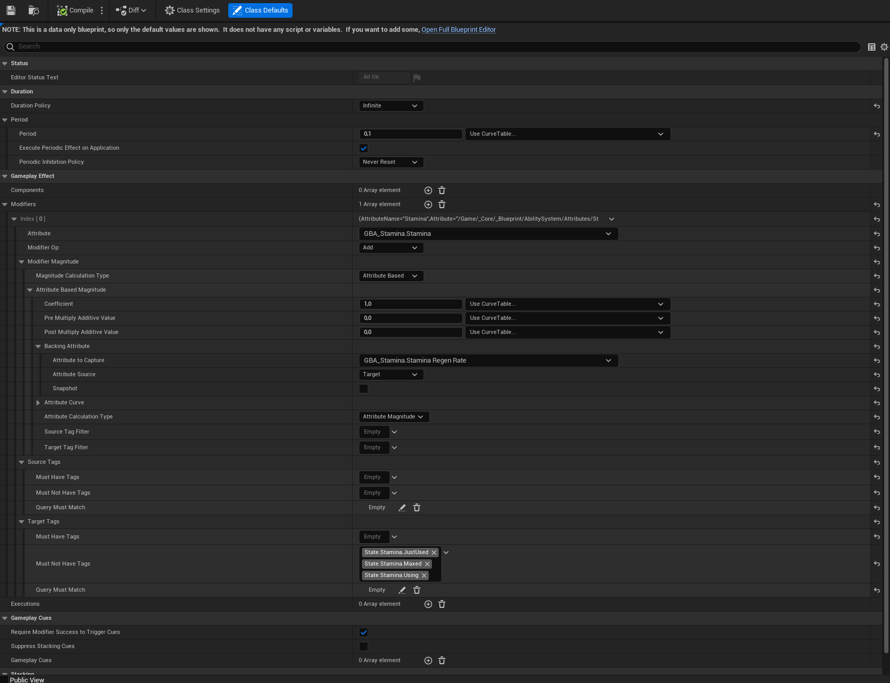

# Effect Sets

Effect sets are just a bonus of this plugin. They don't interfere with any other system of this architecture. So if you want to skip go ahead. But they provide a structured way to implement passive effects that our actors need, or initialize some variables (Such as movement speed, health/stamina regeneration etc.). Generally you want this effect's Duration Policy to have Infinite as value.

Effects can be used in here can be any type of Gameplay Effect, when they added to the AQS, they will get applied to the owning actor at begin play.

## Stamina Regeneration Example

This example will show you how I defined the regeneration of stamina. Stamina will regenerate if stamina has not used for x seconds and not at max value.

First let's create **QueueSystemGameplayEffectSet** [Data Asset](https://dev.epicgames.com/documentation/en-us/unreal-engine/data-assets-in-unreal-engine). 

Than add it to your *QueueAbilityComp*  on your actor to the Granted Effects array.

Though creating gameplay effect is not the part of this plugin, this may help some people.

As you can see I regenerate stamina if character doesn't have this tags: `State.Stamina.JustUsed`, `State.Stamina.Maxed`, `State.Stamina.Using`. I manage this tags (add, remove etc) in the Attribute Set.