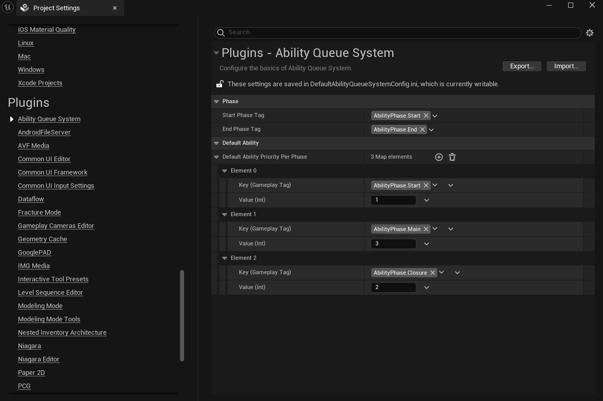
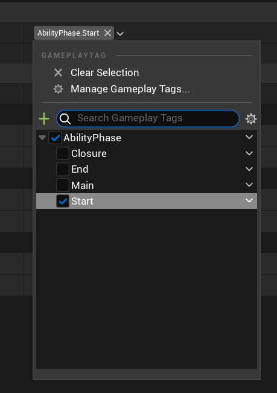
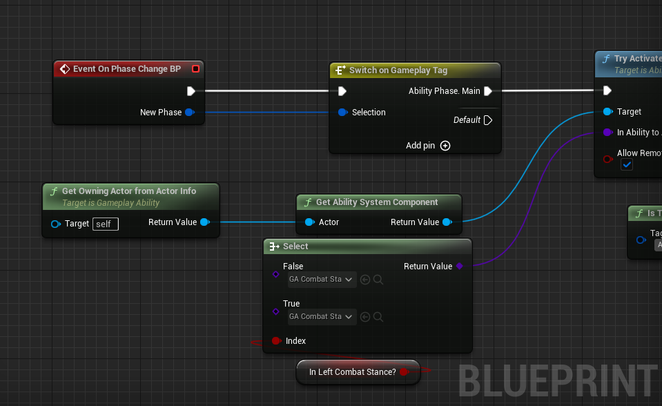
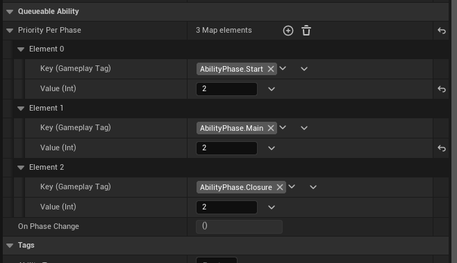
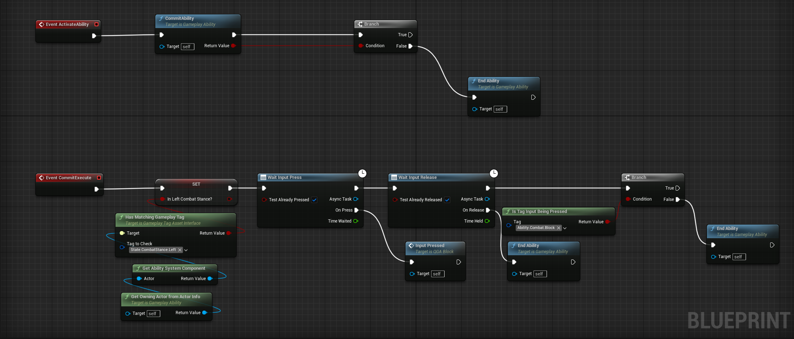
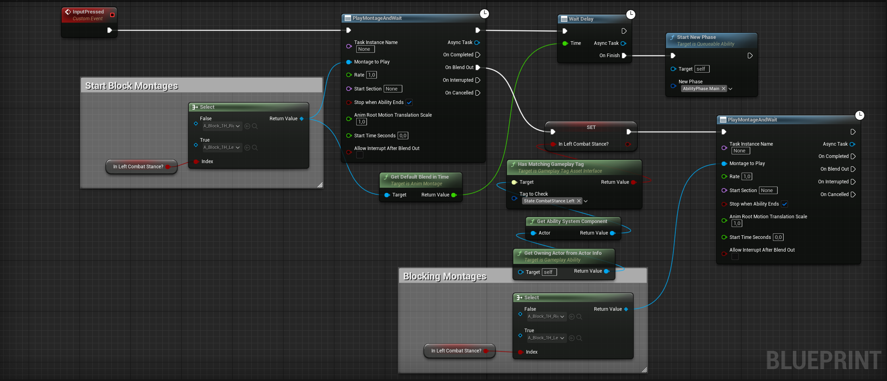
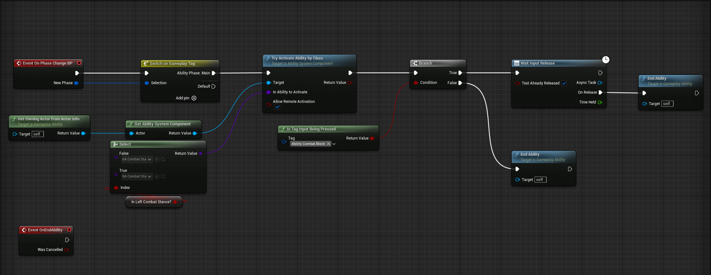
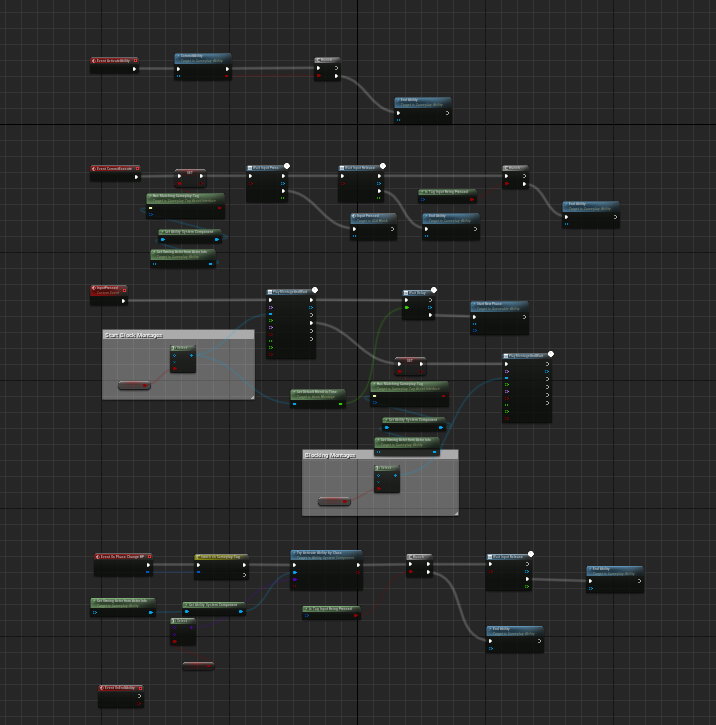

# Queueable Abilites

This ability type -*Queueable Ability*- is a child of **Gameplay Ability*. They have a few extra variables and functions that we are going to mention. 

But first we need to define our **StartPhaseTag** and **EndPhaseTag** from the project settings.

## Project Settings

### Phase 

Go to Project Settings -> Plugins -> Ability Queue System and define your settings here.

* **Start Phase Tag**: Will be the phase of when the ability gets commited (Not Activated!). Also when a input gets added to a queue, input will find the corresponding ability's start phase tag's priority in order to make AQS (Ability Queue System) to determine if the input ability should be activated or not. So you can think Start Phase tag as "input's priority".

* **End Phase Tag**: Is the phase that when reached, ability will be ended/cancelled. So it doesn't need to have it's priority.

### Default Ability

**Default Ability Priority Per Phase** is used for when creating a new **Queueable Ability** this priority map will be used. Making everyone's life easier. (Just keep in mind that if you change anything you have to restart the editor in order to make this effect.)

:::tip
If your Phases should start with the tag **AbilityPhase.**, only child of this tag will be shown. Making editing phases easier! (this is both true in Project settings and in the Queueable Ability itself.)

:::

:::note
Your ability phases doesn't need to be strict except "start phase tag" and "end phase tag", they can be defined per action. For example: Drawing bow could have a "Start, TakeBow, DrawBow, Loop, ReleaseArrow, Recovery, End" phases. Because AQS only tracks the "CurrentPhase's Priority" it doesn' t need to know what is the exact phase. This way in the event from Queueable Ability; **OnPhaseChanged** you can get the new phase and perform new actions, events etc. 

:::

## Using Queueable Ability
With that out of the way we can create our first Queueable Action!

After you create your ability (its is just a child of the default Gameplay Ability), go to the details panel and set your **Priority Per Phase** under the **Queueable Ability** category.

As said you can have many many phases, it would not be a problem. Also you don't need to add the "End" phase as said.

That's it now there is currently 2 function and 1 event that we can use extra.

| Function/Event Name | Parameters | Return | Description |
| --- | --- | --- | --- |
| `Event On Phase Changed` | None | `GameplayTag` NewPhase | Whenever a new phase gets started, this event will get run with the new phase as the output. Allowing you to create gameplay events, activating effects etc. |
| `Start New Phase` | `GameplayTag` NewPhase | `void` | Leaps to the new phase given. |
| `IsTagInputBeingPressed` | `GameplayTag` Tag | `bool` ReturnValue | You can "PressInputTaggedAbility" and "ReleaseInputTaggedAbility" as inputs to *AQS*. And this will check if the input is being pressed or not. (Even if ability get initialized long before the input gets released already. (Useful for looping abilities: Blocking, Aiming etc.)) |

## Let's Look At an Example!

I am not saying that I am expert of creating abilities, I am sure there is a way more elegant way to create this abilities, but hey, it proves that this example is a lot to learn from!

### Blocking Ability 

In my game I have 2 melee stances, left and right. Whenever I start the blocking ability, I want my character to also switch it's stance. This ability also does that.

First I commit the ability, and check if it is really commited. Than I get the current stance of the character and wait for the input press (When AQS activates an ability it simulates a input press!) for activating the real ability. Also I check if the key is already released (this can happen before the ability gets activated so we need to check).

Than I play some montages, nothing fancy here. Also I update the Phase to "Main" when the first montage gets blend in.

I use the **Event On Phase Changed BP** so I can handle every phase individually. At main, I Activate an ability that updates the character's left, right stance. And I also check if the input is released or not.

And This is the whole picture!

Just keep in mind that this action can be cancelled at any point! So if you are working with states or smt. you may want to go back to the default when ability is ended.