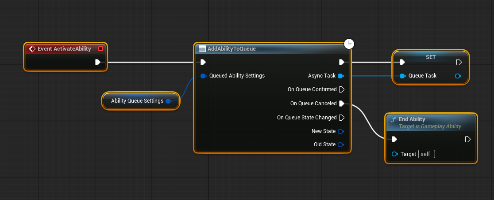
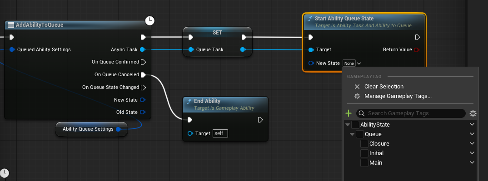
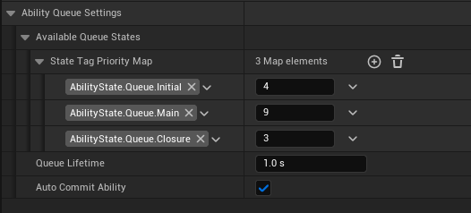

# Add Abilities to the Queue

We have one task to add our `Gameplay Abilities` to the queue.

## Add Ability To Queue Ability Task

This is the main task that we are going to use.

:::warning **What we are actually Queuing?**
Although the feature is called "Add Ability To Queue", the system actually queues the **Gameplay Ability Task Instance** — *one task per queue request*.

Why this matters:
- Each task is a separate request object, so you can request the same ability multiple times while it is already active.

Eg. *Light Attack after another Light Attack.*

- Tasks carry their own parameters and lifetime, letting each queue entry behave independently (useful for combos or repeated inputs).

When to use it: call *Add Ability To Queue* from input handlers or gameplay events to request activation. If you need to stop a pending request, cancel or end the task before it reaches activation.

*We will see more examples on the following pages.*
:::

#### How to change the current state?

Store the `Add Ability To Queue` Gameplay Task in a variable when you create it. To update that queued request, call `Start AbilityQueueState` on the task and pass the new state tag — the task will update its priority in the queue when its state changes.

Examples
- Animation notifies: fire gameplay events from montage notifies to set `Initial`, `Apex`, `Recovery` as the animation plays.
- Input flow: on input release or hold-time expiration set the task to a `Recovery` or `Hold` state.
- Gameplay events: on hit, stagger, or combo conditions set the task to `Apex`, `Combo`, or another relevant state.

You can trigger state changes from the ability's Blueprint (ability event graph), from the task variable stored on the ability, or from any system that has access to the owner of this ability.

### Inputs

#### Queued Ability Settings (Type: `FAbilityQueueInitialSettings`)

This is and example of the Queue Settings:

| Parameter | Type | Description |
|-----------|------|-------------|
| **Available Queue States** | `FQueueTaskStateData` (struct) | A map of ability state tags → priority integers. `The first entry in the map is treated as the *Initial State*` (the state that starts automatically when the ability is activated from the queue and is used to compute the ability's queue priority). Higher numbers = higher priority. |
| **Queue Lifetime** | `float` (seconds) | How long (in seconds) this queued request can stay in the queue before it is automatically removed. Default: `1.0`. (Minimum 0.0.) |
| **Auto Commit Ability** | `bool` | When true the ability will attempt to automatically commit when activated from the queue. This requires the ability's `CommitCheck()` to succeed. When auto-commit is true, `OnQueueConfirmed` will be invoked shortly after commit (similar timing to `OnCommitExecute`). When false you must commit manually if needed. For example if character does not have the required stamina, commit check will fail, and ability won't even be the playing ability. |

Defining your `Ability Queue States` as general is possible is helpful to divide your abilities into logical segments. Like *Startup, Apex, Recovery*. Because when the ability state gets changed, ability's priorty gets changed too. And you can bind your State Changing events to the different gameplay events in your game. Such as *When Reached Main State, consume stamina* etc.

:::tip **Creating Your Ability State Gameplay Tags**
If you define your Gameplay Tags with prefix: `AbilityState` on the project settings, gameplay tag selection will only display the tags under the *Ability State*.

:::

---

### Outputs

#### On Queue Confirmed

Called whenever the task is now the *Playing Task*. If you had ticked the `Auto Commit Ability` on the `Queued Ability Settings` when this gets triggered ability will be commited too. (So you could just use the `Event CommitExecute` on the actual Gameplay Ability.)

#### On Queue Canceled

Called when the ability was removed from the queue without being activated. This can happen if the ability was cancelled or the queue lifetime had expired or if another ability with higher priority was added to the qeueue.

:::note
If the Ability was playing but cancelled beacuse of another ability took it's place, `On Queue Canceled` won't get fired. **Instead the abiliy was playing will be cancelled.** 
:::

#### On Queue State Changed

Called wheneverthe ability's state is changed while it is currently the playing ability on the `Ability Queue Manager`. Ability States are changed by calling `Start Ability Queue State`.

- *New State*: Is now the active state
- *Old State*: Previous State that was active (FGameplayTag::Empty if there was no prior state).

---

That is how you add your abilities to the queue! You are now ready to create your own queueable abilities. But there are few tricks and examples that I can show you in the following pages.