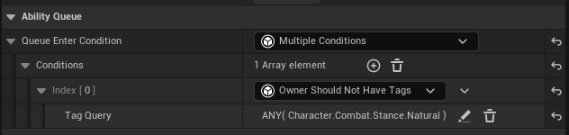
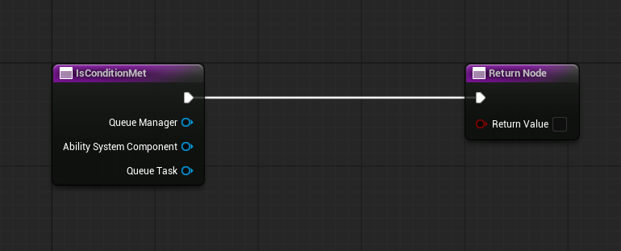
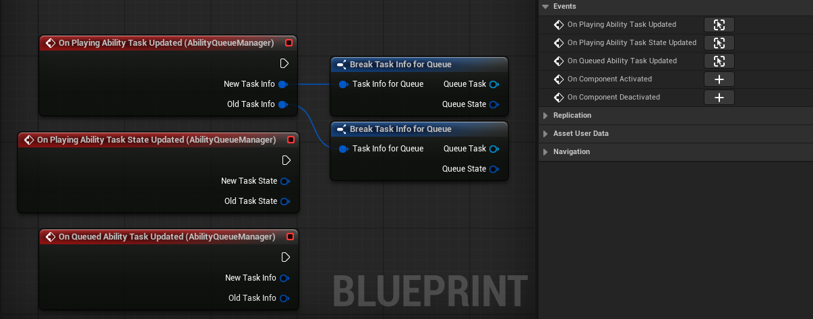

# Startup

Once you installed your plugin with your desired method we can start using it. If you are not sure how to work with plugins make sure to look at this [documentation](https://dev.epicgames.com/documentation/en-us/unreal-engine/plugins-in-unreal-engine).

## Ability Queue Manager Component

Attach the **Ability Queue Manager** Actor Component to any actor that already has an **Ability System Component** (for example a Pawn or Player State). After attaching, abilities can call the supplied `Add Ability To Queue` task — the manager evaluates the request and enqueues abilities as appropriate. When whenever abilities gets refreshed (Ability state change, new ability gets added to the queue or manually (By using `Check for Queued Task Activation` function.)) it tries to play the most prior ability.

### Queue Enter Condition
You can optionally provide a **Queue Enter Condition** to allow or block abilities from entering the queue. This is a Blueprintable class based on `Ability Queue Enter Condition Base` that receives the ability context and returns true to allow queueing or false to block it. You can add your *Conditions* from the details panel of the *Ability Queue Manager Component*.

Quick Blueprint setup
1. Create a Blueprint that inherits `Ability Queue Enter Condition Base`.
2. Implement the `IsConditionMet` event and return true/false.
3. Assign the Blueprint to the `Queue Enter Condition` property on your `Ability Queue Manager` component.

Common uses: disable queueing during cutscenes, block specific ability tags, or require a resource threshold (stamina, etc.) before allowing enqueue.

:::tip **Use Case**
Keep reusable enqueueing rules in a single Blueprint condition (for example: disable queueing during cutscenes). This avoids duplicating checks inside many abilities.
:::

## Delegates

There are some delegates that is called whenever the *Queue Manager* gets an update.

- **On Playing Ability Task Updated** : Called whenever the playing ability on the queue gets changed.

- **On Playing Ability Task State Updated** : Called whenever the playing ability's task updates it's *Queue State*.

- **On Queued Ability Task Updated** Called whenever the queued ability task gets changed.

:::note Where to Use Them?
I personally don't use them in a gameplay scenerio. But they are helpful if you want to debug the Ability Queue.

Though you can always type on the console to enable debug view.

`AbilityQueue.EnableDebugMode 1`
:::

---

That is for the setup. We just needed the *Ability Queue Manager* Component to be on the Actor that has the *Ability System Component*. We can continue with our *Abilities*!