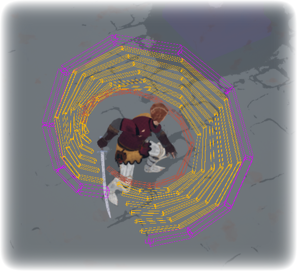
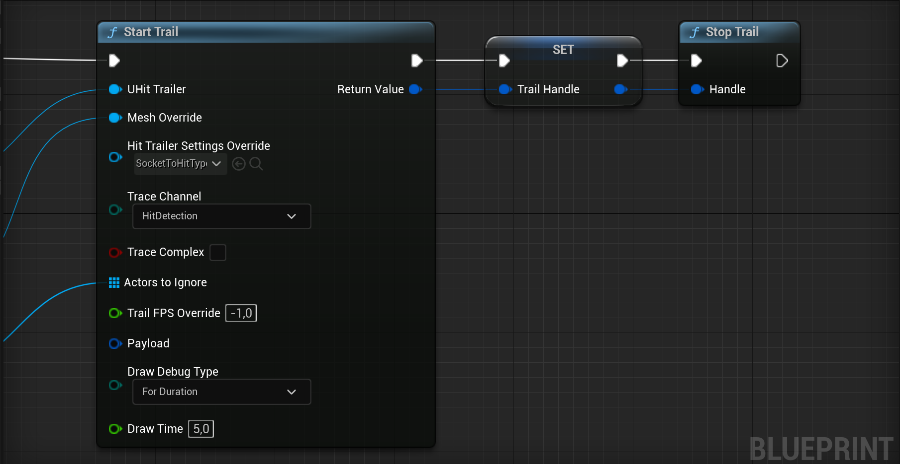

import PluginLinks from '@site/src/components/PluginLinks';

# Advanced Hit Trailer Overview

<PluginLinks pluginId="AdvancedHitTrailer" />

## Video Overview

Watch this comprehensive tutorial to see **Advanced Hit Trailer** in action:

<iframe width="100%" height="400" src="https://www.youtube.com/embed/a8clpcFSLOE?start=989" title="Advanced Hit Trailer Tutorial" frameborder="0" allow="accelerometer; autoplay; clipboard-write; encrypted-media; gyroscope; picture-in-picture; web-share" allowfullscreen></iframe>

*This video demonstrates the complete workflow from setup to implementation.*

## Overview

The Advanced Hit Trailer plugin offers a robust and modular system designed to generate multiple hit results from selected skeletal mesh sockets over time. This tool provides the flexibility to activate or deactivate trails using handles, simplifying complex tracing operations for your projects.

## Key Features

 * Dynamic Tracing System: Seamlessly manage multiple traces with a dedicated handle, offering fine control over your hit detection.
 * Rich Hit Data: Gather detailed hit information, including hit type, speed, socket location, and custom trail payloads.
 * Customizable Trace Sources: Use data assets to define specific hit sockets and types for each trail, ensuring accuracy and precision.
 * Streamlined Project Settings: Easily set default data assets for trailing within your project settings, reducing setup time.
 * Enhanced Debugging: Visualize and troubleshoot trails with built-in debugging tools, making development smoother and more efficient.

:::info
    Hit Results of the Trail: Similar to Unreal Engine's `MultiBoxTracingByChannel` Blueprint Node.
    This means:
    * A Trail can hit an actor once.
    * Trace channel must overlap with the actors (not block).
    * A trail can hit multiple Actors at once.

    But you can always stop the trail when a actor gets hit. So you have the best of the both worlds.

    
:::

Though this plugin is easy to use, there are a few key concepts to understand to make the most of its powerful features.