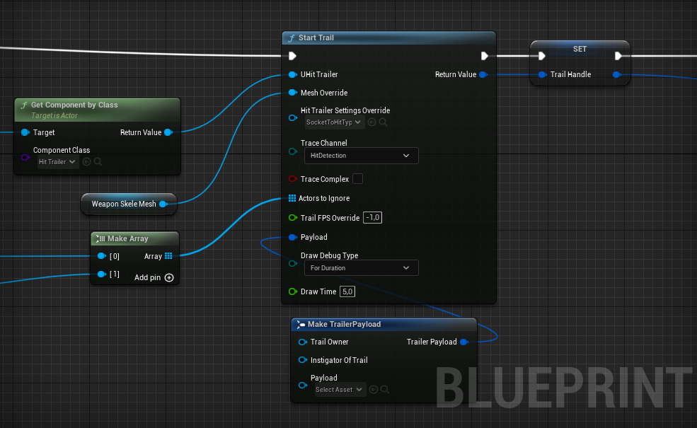
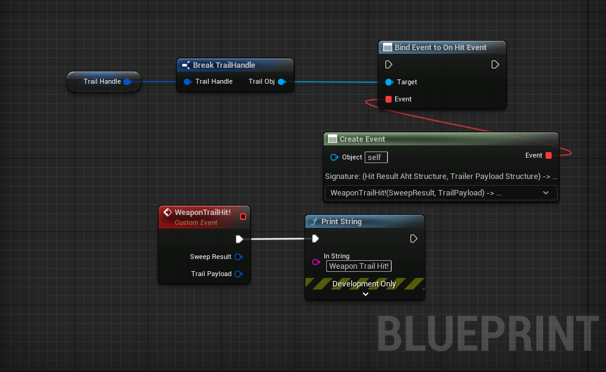

# How To Use It

There are only 2 static functions that you need to use to start the trail and stop the trail.

## Start Trail

### Start Trail Inputs 
    * **UHit Trailer**: The Hit Trailer Component. 
    * **Mesh Override**: The Skeletal Mesh to trail. If not given function will try to find a skeletal mesh component of the `UHitTrailer`'s owner actor.
    * **Hit Trailer Settings Overide**: The Data asset to be used to find the sockets from the skeletal mesh and get the related values for the trail.
    * **Trace Channel**: The channel to trace from. You should use an overlapping trace for the trace's targets.
    * **Trace Complex**: Wheather the trace should be a normal or complex (just like in default tracing).
    * **Trail FPS Override**: The time of interval between traces will be determined by this value. If given below zero, given Hit Trailer's `Trail Interval FPS` value will be used.
    * **Payload**: This has no impact of the tracing but can be accessed from the trail's hit result.
    * **Draw Debug Type**: Wheather to draw debug trails or not. If so, how?
    * **Draw Time**: If `DrawDebugType` is set to `For Duration` trail lines will persist for the given duration.

 ### Start Trail Output
    * **Return Value**: The handle to keep track of the trail. You can break it to get the `Trail Obj` and bind event on `OnHitEvent`. And also you need this handle to `Stop the  Trail`.

:::note
        To bind events inside functions use *Create Event* node. Otherwise events cannot be used inside blueprint functions.
:::

## Stop Trail

This is simple enough. Just keep in mind that you cam stop the trails even if it is already stopped. So you don't need to check it.

