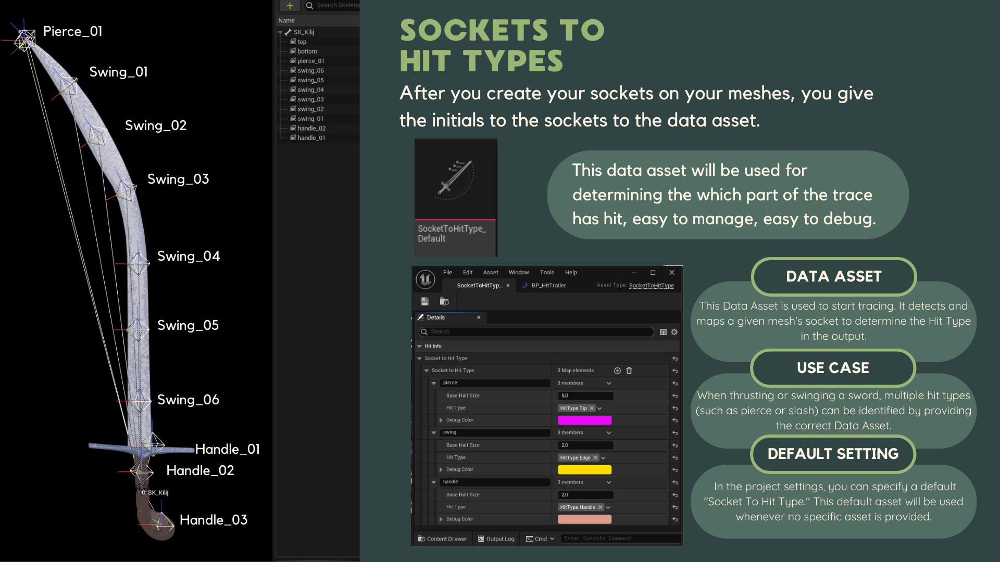

# Setup

There are only 2 assets that you need to use.

## Hit Trailer Component

This component is responsible for managing the created trails (Trails are UObjects), and giving them default values (which can be overridable when starting to trail.)

The base class of this component can be added both in C++ or blueprint. But I recommend creating a child of this class, `HitTrailer`.

After you create it in the details panel there is an option to select the default FPS of the trails. Don't worry they are overridable per trail. it's useful to have an appropriate default value.

### On Hit Registered

After this you have a overridable event listed on your functions. Press the `override` button to see it. (Hover over over the functions tab and it will appear).

This event will fire whenever a trail created from this component gets a valid hit result. Please note that the sweep result is just a one `MultiTraceByChannel Result`. In short it is "One single Box" of the Debugging visualisation.

## Socket To Hit Type Data Asset

This [Data Asset](https://dev.epicgames.com/documentation/en-us/unreal-engine/data-assets-in-unreal-engine) type is responsible for getting all the sockets that is going to be used and map them to a relevant data. 

Create an instance of this data asset by Right Clicking your content browser -> Go To Miscellaneous -> Data Asset and find the `Socket To Hit Type`

### Socket To Hit Type Map

You need to populate this field by your skeletal mesh sockets.

* **Key [Name]** : The Skeletal Mesh Socket Initials. For example Skeletal Mesh Sockets has  swing_01, swing_02, ... swing_09.. By typing swing as a key, you map all the swing_.. sockets to key's value.
* **Value [FHitType]**
    * **Base Half Size**: The half size of the tracing box's edge.
    * **Hit Type**: The gameplay tag that is associated with the *Effect of the Hit*. Useful for calculating damage, deciding particle and sounds etc.
    * **Debug Color**: The color for when debugging the trace.

:::info
    Trailing will be performed in the order of the map values, from the first to the last. If a Hit type has higher priority than another, you can place its corresponding socket earlier in the list.
:::

This image summarises the process of creating `SocketToHitTypeInfo` to your meshes.

#### Project Settings

You can have a default Socket To Hit Type Map so that when you don't give a SocketToHitType while tracing, default asset can be used.

