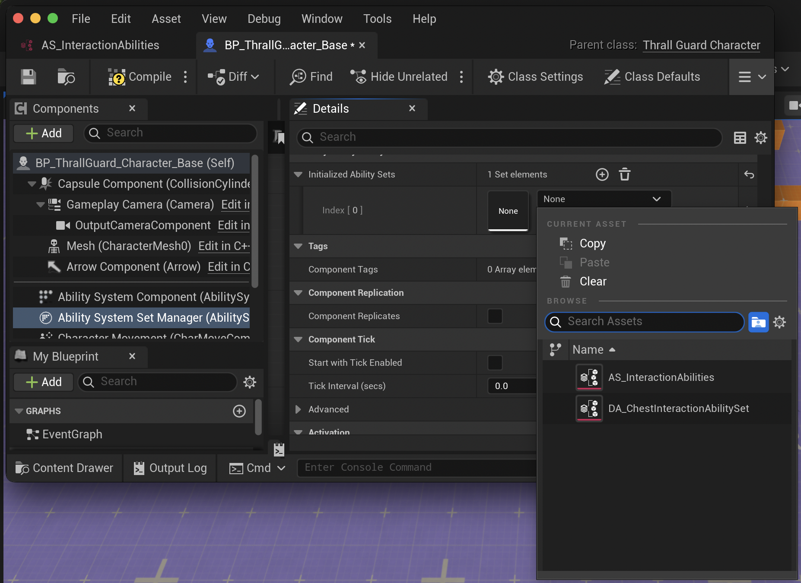

# Ability Sets

**Ability Sets** are [Data Assets](https://dev.epicgames.com/documentation/en-us/unreal-engine/data-assets-in-unreal-engine) that group related abilities together.  
For example: *Combat Abilities*, *Interaction Abilities*, or *Knockback Abilities*.

---

## Defining an Ability Set

When you create an *Ability Set* Data Asset, you’ll see an array of **FEasyGrantAbilityData** entries.  
Each entry lets you define:

- **Ability:**  
  The Gameplay Ability class to grant.

- **Input Tag:**  
  (Optional) A Gameplay Tag used to bind this ability to an input.  
  If you don’t set this, the ability won’t be bound to any input.

- **Ability Level:**  
  The level or strength of the ability.

**Example in the editor:**  


---

## How It Works

- For each ability, you pick the class, set if it should have an input tag, and (if so) which tag, plus its level.
- The system uses the Gameplay Tag’s hash to generate a unique input ID for each ability.
- If you don’t provide an Input Tag, the ability is not bound to any input (`INDEX_NONE`).

:::note
This data is used as input for the standard [Give Ability Function](https://dev.epicgames.com/documentation/en-us/unreal-engine/BlueprintAPI/GameplayAbilities/GiveAbility?application_version=5.6), but with a Gameplay Tag instead of a plain integer.  
The tag is converted to an integer using `FGameplayTag::GetTypeHash()`, ensuring each tag is unique and safe to use as a key.
:::

---

## Why Use Ability Sets?

:::tip
Even if you only want to grant a single ability (like in example), using an Ability Set is best practice.  
- It keeps your project organized.
- It makes removing/clearing abilities easy: the system tracks which abilities were granted by each set, so you can clear them all at once.
:::

---

# Easy Ability System Set Manager

The **Ability System Set Manager** is an **Actor Component** (not an Ability System Component).  
You add it to any actor that already has an Ability System Component. This keeps things modular and lets teams customize their Ability System Component as needed.

Once added, the Set Manager can handle granting and removing ability sets for that actor.

### Initialization

On the component, there’s a field called **Initialized Ability Sets**.  
Any sets you add here will be automatically granted to the Ability System Component when the game starts (on the server).



---

## Managing Ability Sets at Runtime

You can grant or remove ability sets at any time, either in Blueprints or C++:

- **Blueprint:**  
  - Use **Give Ability Set** to grant all abilities/effects from a set.
  - Use **Remove Ability Set** to remove everything previously granted by that set.

- **C++:**
  ```cpp
  AbilitySystemSetManager->GiveAbilitySet(MyAbilitySet);
  AbilitySystemSetManager->ClearAbilitySet(MyAbilitySet);
  ```

This makes it easy to add or remove groups of abilities as your game changes—no need to track each ability individually!