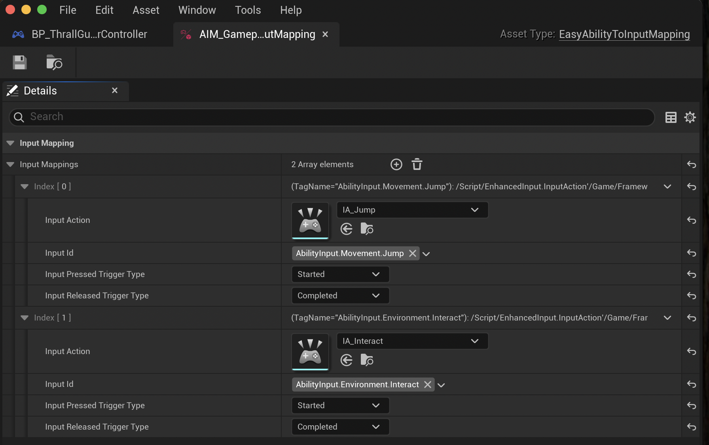
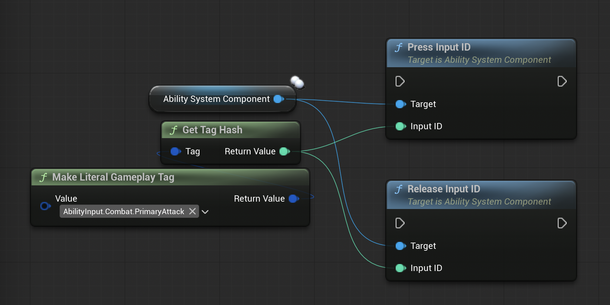
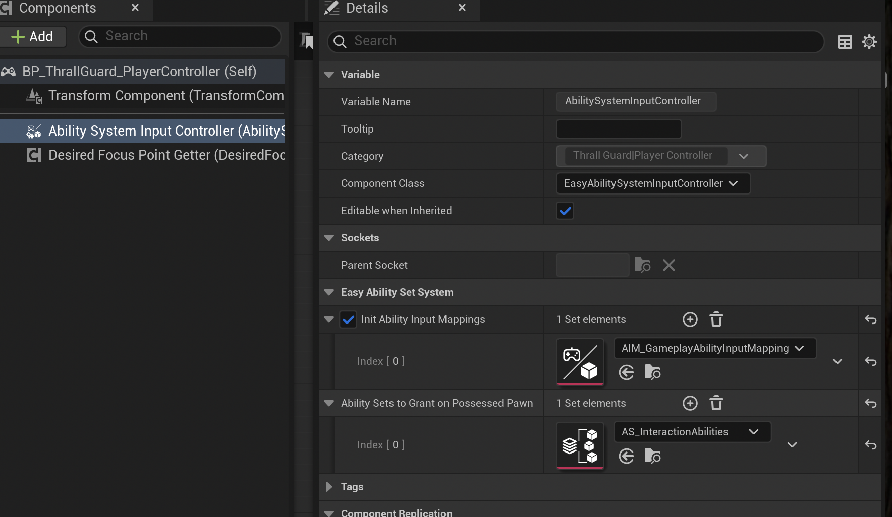

# Ability To Input Mappings

You can easily set up input mappings for your controller using Data Assets.  
Each mapping links an [Input Action](https://dev.epicgames.com/documentation/en-us/unreal-engine/enhanced-input-in-unreal-engine) to a *Gameplay Tag*.

These Gameplay Tags act as input IDs for the abilities you defined in your [Ability Sets](/docs/Easy-Ability-Set-System/AbilitySets).

Once you’ve created your input mappings, add them to the **Ability System Input Controller** component on your *Player Controller*.

:::note
These input mappings are for players using Enhanced Input.  
The component automatically presses or releases the correct input IDs on the Ability System Component of the possessed pawn (it works whether the Ability System Component is on the pawn or its player state).  
For NPCs, you can use the standard "Press Input ID" or "Release Input ID" functions on their Ability System Component.

:::

---

# Ability System Input Controller

Add the **Ability System Input Controller** to your Player Controller and fill out its fields:

You can add your Input Mappings here if they are enabled.

:::tip
The **Ability Sets to Grant on Possess Pawn** field is used to automatically grant ability sets when the player controller possesses a pawn, and remove them when unpossessed.  
This is especially useful for abilities that should only be available on player-controlled pawns.
:::

