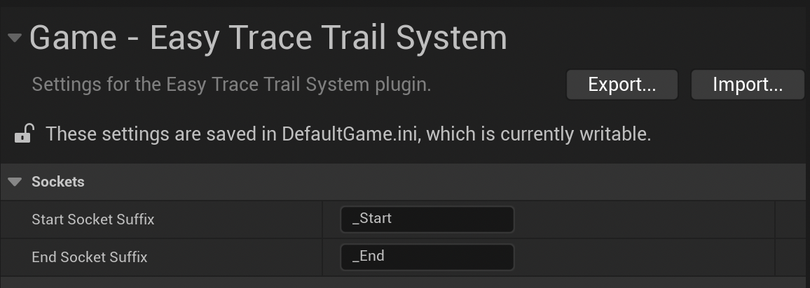

# Setup

Once you installed your plugin with your desired method we can start using it. If you are not sure how to work with plugins make sure to look at this [documentation](https://dev.epicgames.com/documentation/en-us/unreal-engine/plugins-in-unreal-engine).

## Setting Up Your Meshes to Trace

You can trace along any primitive component that can have [Sockets](https://dev.epicgames.com/documentation/en-us/unreal-engine/setting-up-and-using-sockets-with-static-meshes?application_version=4.27), such as Skeletal Meshes, Static Meshes with this plugin.

Open up one of your meshes that you want to trace and then we can create our sockets we can define trace sections.

### Sections

Sections are logical divisions of your weapon or object that allow you to detect which specific part made contact during a hit. Each section can carry different information and trigger different behaviors based on what part of the object hit the target.

For example, in a combat game, a spear has two distinct parts: a blunt wooden handle and a sharp steel tip. By defining separate sections for each part, you can detect whether the target was hit by the handle (causing blunt damage) or the tip (causing piercing damage).

  

In the image example, we can see that there are 4 sections, *Tip_01*, *Edge_02*, *Edge_01*, *Handle_01*. They are divided by their *Prefix*. And the sections are defined by their *suffix*.

**Socket Naming Convention:**
- **Complete socket name format**: `Prefix_Number_Position` (e.g., "Tip_01_Start", "Tip_01_End")
- **Section definition**: Each section requires exactly 2 sockets with "_Start" and "_End" suffixes
- **Settings sharing**: All sections with the same prefix share the same trace settings from Mesh Per Socket Section Data

**Example sections:**
- **Tip_01_Start** + **Tip_01_End** = One complete "Tip" section
- **Edge_01_Start** + **Edge_01_End** = One "Edge" section  
- **Edge_02_Start** + **Edge_02_End** = Another "Edge" section
- Both Edge sections use the same settings defined by the "Edge" key in *Mesh Per Socket Section Data* (This setting will be explained later).

This sections will be mapped to a *Gameplay Tag* of your choice. They could even share the same gameplay tag even if their section names are different.

**Settings mapping:**
- Prefix "Tip" → Uses settings from "Tip" key in Mesh Per Socket Section Data
- Prefix "Edge" → Uses settings from "Edge" key (shared by Edge_01 and Edge_02 sections)
- Prefix "Handle" → Uses settings from "Handle" key

:::note
If you want to change the *Suffix* naming, you can change it in your project settings.

:::

:::tip
Sections typically connect end-to-end along your weapon. When one section ends, the next section begins at exactly the same point. This means the ending socket of one section and the starting socket of the next section should be positioned at the same location.

**Time-saving tip:** Instead of manually positioning each socket, you can copy the transform values from the ending socket of one section and paste them to the starting socket of the adjacent section.
:::

After you divide your mesh into their logical component, you are ready to use that mesh to make hit-trails.