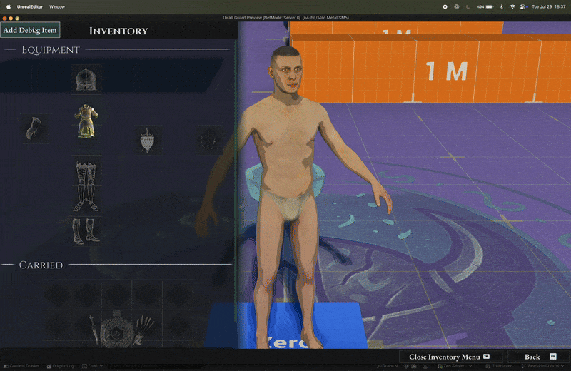
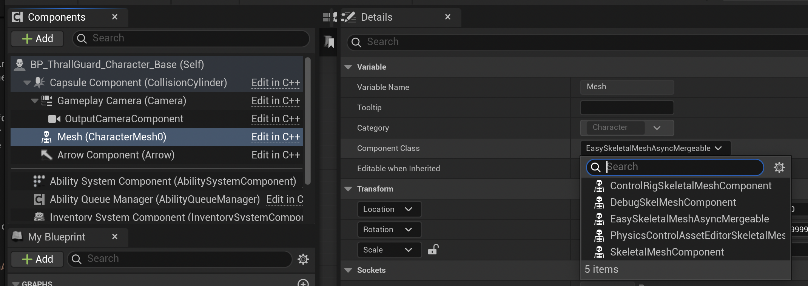
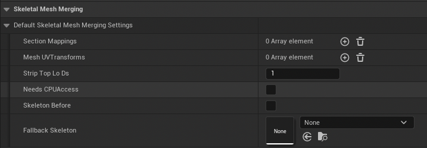
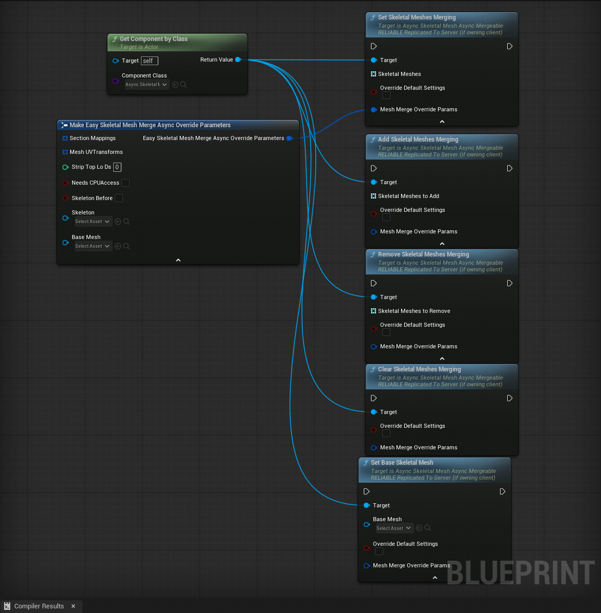
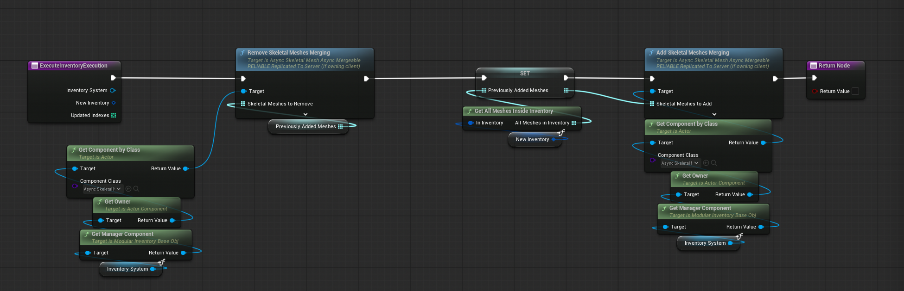

import PluginLinks from '@site/src/components/PluginLinks';

<PluginLinks pluginId="Easy Skeletal Mesh Merge Async" />

# Easy Skeletal Mesh Merge Async

**EasySkeletalMeshMergeAsync** is an Unreal Engine plugin that lets you merge skeletal meshes *asynchronously* at runtime, making modular characters easy and efficient.

Many modular character solutions are hard to manage or cause extra draw calls, hurting performance. While Epic's [Skeletal Merging](https://dev.epicgames.com/documentation/en-us/unreal-engine/API/Plugins/SkeletalMerging) plugin solves this, it can be tricky to use and manage hard references or replication.  
This plugin builds on Epic's system, but offers a much simpler API and workflow.

## Video Overview

Watch this comprehensive tutorial to see **EasySkeletalMeshMergeAsync** in action:

<iframe width="100%" height="400" src="https://www.youtube.com/embed/Vn82nP2bj0s?start=33" title="Easy Skeletal Mesh Merge Async Tutorial" frameborder="0" allow="accelerometer; autoplay; clipboard-write; encrypted-media; gyroscope; picture-in-picture; web-share" allowfullscreen></iframe>

*This video demonstrates the complete workflow from setup to implementation.*



## Features

- **Async Skeletal Mesh Loading:** Merge meshes *without blocking the game thread*.
- **Component-based:** Add merge capability to *any actor* or *override the default skeletal mesh component* on characters.
- **Task-based:** Loading and merging are handled as background tasks. Which is cancelled whenever a new request comes. Ensuring *stability*.
- **Network-ready:** *Replicate* merged meshes so all players see the same result.

## Installation

**From Epic Fab**
1. Install the plugin to your engine.
2. Enable it in Unreal Engine's plugin settings.

**Manual**
1. Copy `EasySkeletalMeshMergeAsync` to your project's `Plugins` folder.
2. Regenerate project files and build.
3. Enable the plugin in Unreal Engine.

## Usage

### Adding the Component

- Add the `UEasySkeletalMeshAsyncMergeable` component to any actor.
- Or, replace your actor's default skeletal mesh component with `EasySkeletalMeshAsyncMergeable`.



### C++ Example

```cpp
#include "Component/EasySkeletalMeshAsyncMergeable.h"
```

### How It Works

- The plugin uses a background task (`LoadSkeletalMeshesAndMergeTask`) to load and merge meshes on every client.
- The main component, **UEasySkeletalMeshAsyncMergeable**, manages the tasks and ensures stability between clients.

## Runtime Merging

Most settings work out-of-the-box. Advanced parameters are inherited from [Skeletal Merging](https://dev.epicgames.com/documentation/en-us/unreal-engine/API/Plugins/SkeletalMerging).  
You can override the base skeletal mesh via the component if needed.

:::warning
The `Base Skeletal Mesh` parameter is set from the first mesh at begin play, but can be changed with `Set Base Skeletal Mesh`.

Do not use the default `Set Skeletal Mesh` on the component. It can cause inconsistency between clients.
:::



You'll find several merge methods in the component:



Most functions focus on currently equipped meshes, with parameters for custom effects.  
`MeshMergeOverrideParams` matches Epic's Skeletal Merging options.

:::note
You don't need to touch `Mesh Merge Override Params` for basic use—meshes will merge with correct materials.  
For advanced users: you can customize UVs for single-material meshes or further customization (see [this video by Prismatica](https://www.youtube.com/watch?v=A-P0llMckSw)).
:::

## Example: Inventory Integration

When an item with a mesh is added to a slot, merge it with the base mesh—perfect for inventory systems!



This example function runs whenever an inventory slot changes content.

## Support

- [GitHub Issues](https://github.com/Elmarath/EasySkeletalMeshMergeAsync)
- [Discord Community](https://discord.gg/HghXuWHJJx)

---

*If you use this plugin, please consider leaving a review or feedback!*