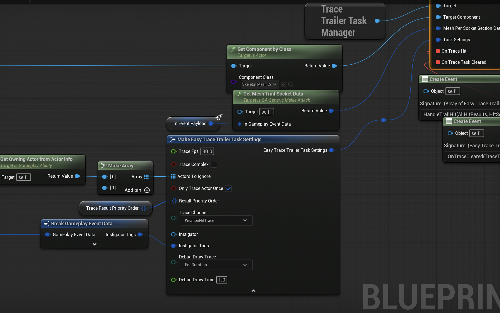

# Creating Hit Trails

This plugin manages it through a [World Subsystem](https://dev.epicgames.com/documentation/en-us/unreal-engine/programming-subsystems-in-unreal-engine). World Subsystems can be accessed in your classes if they have a world access. Meaning if you can do any tracing normally in your class, you can create a hit-trail too. To access this subsystem get *Trace Trailer Task Manager*. From that subsystem you can access *Create And Register Trace Task* function.

## Create and Register Trace Task Function

This is the function to create our traces with given settings. Once it is created we have events that we can bind to. And an output *Easy Trace Trailer Task* object reference.

### Inputs

These inputs will control how the hit-trail will behave. 

:::tip **Real-World Implementation Example**
Let's look at how to use these parameters in a practical combat system implementation.

**Step 1: Create and Store the Task**  
In this [Gameplay Ability](https://dev.epicgames.com/documentation/en-us/unreal-engine/gameplay-ability-system-for-unreal-engine) example, I create the trace task and store its reference in a variable for later access (like clearing the task when the attack ends).

**Step 2: Get the Mesh Component**  
I retrieve the weapon's *Skeletal Mesh Component* from the character's equipped weapon.

**Step 3: Configure Section Data**  
The *Mesh Trail Socket Data* comes from weapon attributes I've pre-configured:

**Dynamic Section Mapping:**  
Notice I use two different *SocketToPrefixData* configurations. This allows different attack types to use different weapon sections, or use the same socket sections with a different tag mapping.
- **Thrust attacks** → Uses "Tip" section for precise stabbing damage
- **Swing attacks** → Uses "Edge" section for slashing damage  

   

This flexibility lets you map the same physical weapon sections to different [GameplayTags](https://dev.epicgames.com/documentation/en-us/unreal-engine/using-gameplay-tags-in-unreal-engine) based on the attack type.

**Task Settings Configuration:**  
I use consistent values for trace settings that mirror how you'd configure standard Unreal Engine traces.

**Important: Trace Channel Setup**  
Use an **Overlap** [Trace Channel](https://dev.epicgames.com/documentation/en-us/unreal-engine/traces-in-unreal-engine---overview) rather than **Block**. Blocking traces stop at the first hit, preventing detection of multiple targets. For single-hit mechanics, manually clear the task in your *OnTraceHit* event instead.
:::

| Parameter | Type | Description |
|-----------|------|-------------|
| **Target Component** | Primitive Component Object Reference | Skeletal or Static Mesh Component that we are going to use to do the tracing. |
| **Mesh Per Socket Section Data** | Easy Trace Mesh Section Struct | Contains the mesh component and socket section information that defines which parts of your object will be traced. |
| **Task Settings** | Easy Trace Trailer Task Settings Structure | Configuration settings that control how the trace behaves, including trace frequency, collision channels, and other parameters. |
| **On Trace Hit** | Delegate | Event that fires when the trace detects a hit, allowing you to handle collision responses and damage logic. |
| **On Trace Task Cleared** | Delegate | Event that fires when the trace task is completed or manually cleared, useful for cleanup operations. |

### Data Structures Reference

This section explains the key data structures used by the Easy Trace-Trail System.

#### Easy Trace Shape Types (Enum)

The plugin supports three different trace shapes for hit detection:

| Shape Type | Description |
|------------|-------------|
| **Line Trace** | Simple line-based collision detection, fastest performance |
| **Sphere Trace** | Spherical collision detection, good for projectiles or area effects |
| **Box Trace** | Rectangular collision detection, best for sword edges and similar weapons |

#### Easy Trace Mesh Socket Data (Struct)

This structure defines the trace settings for individual sockets on your mesh.

| Property | Type | Description |
|----------|------|-------------|
| **Socket Tag** | Gameplay Tag | Identifier for the socket, used to distinguish hit results from different parts of your weapon |
| **Trace Shape** | Easy Trace Shape Types | The collision shape to use (Line, Sphere, or Box) |
| **Virtual Socket Distance** | Float (cm) | Distance to extend the virtual socket from the actual socket location toward the next socket. Controls trace distribution and shape size |
| **Trail Width** | Float (cm) | Width of the trail (only used for Box traces) |

#### Easy Trace Trailer Task Settings (Struct)

Main configuration structure that controls how the trace task behaves.

| Property | Type | Description |
|----------|------|-------------|
| **Trace FPS** | Float | Number of traces performed per second (higher = more accurate, lower = better performance) |
| **Trace Complex** | Boolean | Whether to use complex collision (slower but more accurate) |
| **Actors To Ignore** | Array of Actors | List of actors that should be ignored during tracing |
| **Only Trace Actor Once** | Boolean | If true, each actor will only be hit once per task lifetime |
| **Result Priority Order** | Set of Gameplay Tags | Priority order for hit results - higher priority hits are reported first |
| **Trace Channel** | Trace Type Query | Which collision channel to trace against |
| **Instigator** | Pawn | Optional pawn reference for context in hit events |
| **Instigator Tags** | Gameplay Tag Container | Optional tags for additional context |
| **Debug Draw Trace** | Draw Debug Trace Type | Whether to visualize traces in the world for debugging |
| **Debug Draw Time** | Float | How long (in seconds) to display debug traces |

#### Easy Trace Mesh Section Data (Struct)

Maps socket name prefixes to their corresponding trace settings.

| Property | Type | Description |
|----------|------|-------------|
| **Socket Prefix To Data** | Map (String → Socket Data) | Maps socket prefixes (like "Edge", "Tip") to their trace configuration |

**Example Usage:**
- Prefix: "Edge" → All sockets starting with "Edge" (Edge_01_Start, Edge_02_End) use the same settings
- Prefix: "Tip" → All sockets starting with "Tip" use different settings optimized for tip hits

:::note **How Virtual Socket Distribution Works**
The system ensures complete coverage of your weapon sections without gaps or overflow:

**Automatic Point Generation:**  
The plugin calculates how many virtual trace points are needed using the formula: `Ceil(Section Length ÷ Virtual Socket Distance)`

**Even Distribution:**  
Instead of using your exact Virtual Socket Distance, the system divides the total section length evenly among all virtual points. This guarantees:
- ✅ No gaps between traces
- ✅ No trace shapes extending beyond the section boundaries
- ✅ Consistent coverage across the entire weapon section

**Performance vs. Accuracy:**  
- **Lower Virtual Socket Distance** = More virtual points = More accurate motion tracking
- **Higher Virtual Socket Distance** = Fewer virtual points = Better performance

**Example:** A 100cm sword edge with 15cm Virtual Socket Distance creates 7 virtual points (Ceil(100÷15)) spaced exactly 14.3cm apart.
:::

#### Easy Trace Trail Hit Result (Struct)

The result structure returned when a trace detects a hit.

| Property | Type | Description |
|----------|------|-------------|
| **Hit Result** | Hit Result | Standard Unreal Engine hit result containing impact location, normal, actor, etc. |
| **Socket Tag** | Gameplay Tag | The tag of the socket that generated this hit, allowing you to determine which part of your weapon made contact |

#### Easy Trace Trail Socket Section Runtime Data (Struct)

Runtime data structure created automatically by the system for each trace section.

| Property | Type | Description |
|----------|------|-------------|
| **Socket Section** | String | Runtime-generated unique identifier for the section |
| **Start Socket** | Name | The actual start socket name on the mesh component |
| **End Socket** | Name | The actual end socket name on the mesh component |
| **Section Data** | Easy Trace Mesh Socket Data | User-defined trace settings for this section |
