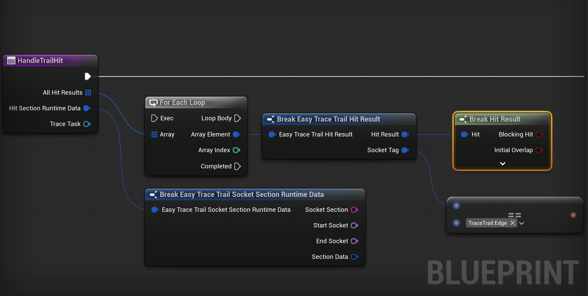

# Managing Trace-Trail Tasks

Once you have created your trail tasks you have events *On Trace Hit*, *On Trace Task Cleared*. With these methods you can affect your game world. It is generally a good idea to hold your *Task Reference* in a variable. So you can clear the task or call some functions when necessary.

## Delegates

This delegates are fired whenever something important happens on the task.

### On Trace Hit

Whenever the trace hits or overlaps, you can get your *hit results* like you have used an *Overlap Shape By Channel*.

:::note **When Does On Trace Hit Fire?**
The delegate fires whenever any trace shape detects a valid collision with an actor on the specified trace channel.

**Multiple Hits Per Tick:**  
The event can fire multiple times during a single trace update if different socket sections hit different actors simultaneously.

**Single Actor Per Tick Rule:**  
Each actor can only trigger the event once per trace tick, even if multiple weapon sections hit the same actor. If you value the priority of sections, use *Result Priority Order* On the *Task Settings*.

**Repeat Hit Behavior:**  
- **Only Trace Actor Once = TRUE:** Actor is added to ignore list after first hit and will never trigger the event again during this task's lifetime
- **Only Trace Actor Once = FALSE:** The same actor can trigger the event again in future trace ticks

**Example Scenario:**  
Your sword hits 3 enemies in one swing → Event fires 3 times in the same tick, once for each enemy.

This part is a bit hard to explain but once you use it I am sure that you will find the behaviour you are looking for. **If not please reach us!**
:::

### On Trace Task Cleared

Called whenever a trace task gets cleared. This can happen if you manually destroy the task using: *Unregister and Clear Trace Task* or the game world gets destroyed.

:::note 
Do not use the *Clear* function on the task. This method is not safe to call to just finish the trailing. Use the *Unregister and Clear Trace Task* on the *Trace Trailer Task Manager*. You should always use that subsystem to manage your tasks.

:::

## Functions

### Perform Trace

This method allows you to manually trigger a trace outside of the normal timer-based system.

**Normal Behavior:**  
The system automatically performs traces at intervals based on your *Trace FPS* setting (e.g., 30 FPS = trace every 0.033 seconds).

**Manual Control:**  
Use this method when you need precise timing control for critical moments in your animations or gameplay:

**Example Use Cases:**
- **Animation Key Frames:** Force a trace at the exact moment of your apex point of your animation.

**Performance Note:**  
This is safe to call multiple times and works alongside the automatic timer system. Extra manual traces won't interfere with the scheduled ones. The system will use the extra call as it's previous tracing point.