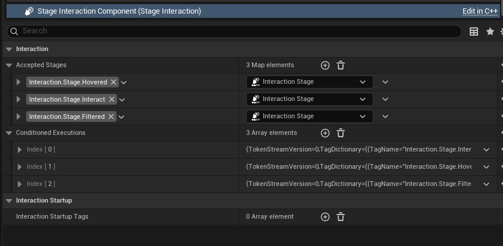

import PluginLinks from '@site/src/components/PluginLinks';

# About Local Staged Interaction Framework

<PluginLinks pluginId="LocalStagedInteraction" />

Creating reliable interaction systems in games can be challenging—both in terms of gameplay design and technical implementation. You need to consider many conditions to determine whether an item can be interacted with, and ensure these states are clearly visible to the player.

This plugin is designed to solve exactly those problems.

By introducing a **Stage-based interaction system**, designers can easily define conditions for when an item is interactable. These same stages can also be used to trigger **executions** that visually or otherwise communicate the interaction state to the player.

This approach is simple yet powerful—making it easier to build and maintain complex player interaction systems. All modules are fully implemented in C++ and are designed to be project-agnostic.

:::note
This is a **local-only interaction system**, meaning it runs entirely on the [Local Player](https://dev.epicgames.com/documentation/en-us/unreal-engine/API/Runtime/Engine/Engine/ULocalPlayer). By design, it includes no replication or multiplayer logic. However, it can be extended to support replicated interaction systems if needed.
:::

## Core Elements

On the actor when you add the interaction system

### [Interaction Stage](/docs/Local-Staged-Interaction/CoreElements/InteractionStage.md)

Interaction **Stages** are [Gameplay Tags](https://dev.epicgames.com/documentation/en-us/unreal-engine/using-gameplay-tags-in-unreal-engine) that can be defined per project. They let you categorize interaction states however you like. You can then use `Gameplay Tag Queries` to determine which **Interaction Executions** should run—automatically managed by the plugin.

### [Interaction Execution](/docs/Local-Staged-Interaction/CoreElements/InteractionExecution.md)

**Interaction Executions** are generally cosmetic, `Instanced UObjects` that run on the interacted actor. They act as visual or sensory feedback systems for the player. For example, they can apply particle effects, overlay materials, or other visual cues when an actor is hovered, overlapped, or interacted with—based on the interaction stage. But you can use them for gameplay purposes also.

---

There are many other customization options available to help you tailor the interaction system to your project’s specific needs.