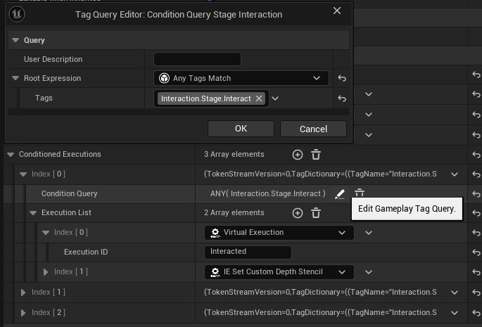
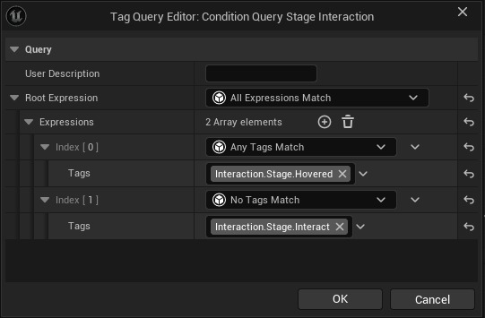
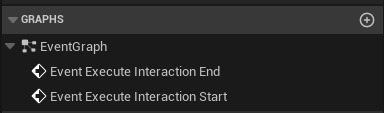
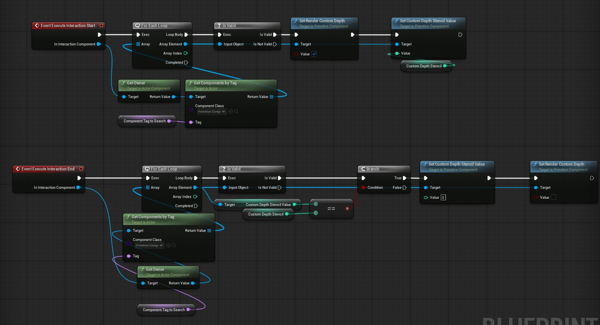
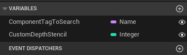
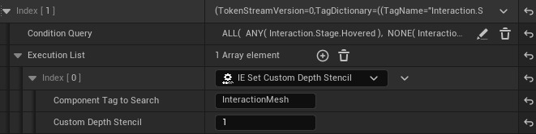

# Interaction Execution

**Interaction Executions** are intended for **cosmetic and visual feedback purposes**. They are used within `Conditioned Interaction Executions`, which are part of the `Stage Interaction Feedback Component`.

Each `Conditioned Interaction Execution` contains:
- A **Gameplay Tag Query**
- An associated **Interaction Execution** instanced object

This structure ensures that visual feedback is only triggered when relevant.



---

## 🔁 How It Works

Whenever the `Staged Interaction Component` updates—by adding or removing interaction stages—the system will automatically:

- Call `ExecuteInteractionExecutionBegin()` on executions that **match** the current tag state.
- Call `ExecuteInteractionExecutionEnd()` on executions that **no longer match**.

This allows developers and designers to easily manage visual responses to gameplay events without hard-coding them.

And since these functions are blueprintable, you can extend the system to do anything from activating particle effects to UI elements.

:::note
The conditions check of the tag state is controlled via `GameplayTag Query`. This is a very roboust system that can query any `GameplayTag` container (which is the Interaction Stage of the component in our case). 

**Eg:**
This query is checking if the item is "hovered" but `not` "interacted".


:::

---

## 🔧 Functions to Override

To implement your own visual behaviors, override the following functions in your custom execution class:

```cpp
void ExecuteInteractionExecutionBegin(UStageInteractionFeedbackComponent* InInteractionComponent);
void ExecuteInteractionExecutionEnd(UStageInteractionFeedbackComponent* InInteractionComponent);
```



## Custom Interaction Execution Example

This interaction execution is the `IE_Set Custom Depth Stencil` from the example on the top. 

Main responsbility of this execution to set the custom depth to a given value on the given primitive components when executed and reset the custom depth when execution ends.

:::tip
[Custom Depth Stencil](https://dev.epicgames.com/community/learning/tutorials/LEKn/unreal-engine-using-custom-stencil-to-selectively-bypass-postprocessing) is a commonly used method for selecting objects for the post process to create custom views. (Such as Outlines, Setting objects visible behind walls etc.)
:::



:::tip
Because the system is using instanced objects on the editor you can edit your custom blueprint variables uniquely on the `Staged Interaction Components`



:::