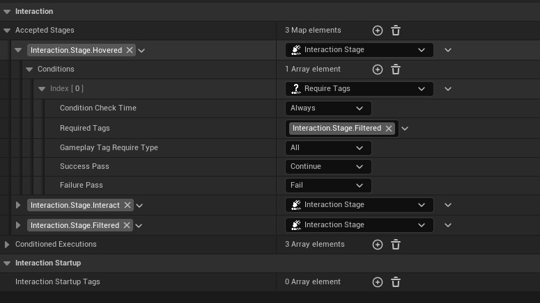
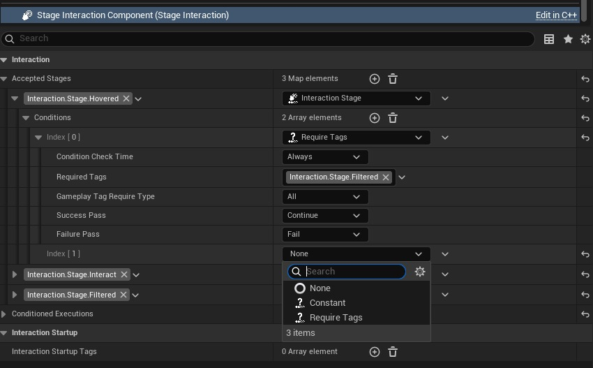

# Interaction Stage

An **Interaction Stage** refers to a pairing of a `Gameplay Tag` (the key) and its associated `InteractionStage` UObject (the value). These pairs are stored as entries in a map within the `Staged Interaction Component`.



The **Gameplay Tag** acts as the unique identifier (ID) for the interaction stage. You can optionally configure special tags in the **Project Settings** under **Local Staged Interaction**.

The **InteractionStage** UObject instance holds the logic and conditions that determine whether a tag can be applied to an actor. Developers can also create custom subclasses of `InteractionStage` to include additional data or complex rules.

Each `InteractionStage` contains an array of **Interaction Stage Conditions**, and **all conditions must pass** for the stage to be successfully added.

---

## 🎯 Interaction Stage Condition

An **Interaction Stage Condition** is a simple, blueprintable `UObject` used within an `InteractionStage` under it's `Conditions`. Its purpose is to decide whether a particular interaction stage can be applied.

It does this through the following function:

```cpp
EInteractionStageConditionPass CanExecuteStageCondition_Native
    (UInteractionStageBase* Stage, FGameplayTag InteractionStageTag,
    UStageInteractionComponentBase* OwnerInteractionComponentBase,
    EInteractionStageConditionCheckingTime InCheckingTime);

// EInteractionStageConditionPass (Apply,Continue,Fail,None)
```
:::tip
`Interaction Stage Condition Pass` Enum values are used this way:
* **Apply**: Apply stage without checking any other condition. 
* **Continue**: Condition has passed, but check the other conditions before applying the stage.
* **Fail**: Condition Failed, stage won't be added.
* **None**: Placeholder, works like the `Fail`.
:::


`Interaction Stage Condition`s are **Blueprintable**. So you can create your own conditions to decide weather a given interaction stage can be added to a component. Then use them inside your Interaction Stages. 

### Require Tags
 A simple example condition that checks if a stage can be added by looking at the component's current tags. If component has no `Required Tags` previously given stage won't be added.

### Constant
 A conditions that will always return the given result. Mostly used for debugging.



This function checks if the condition is met, based on the current context (such as the component and tag involved). The system automatically evaluates conditions whenever an interaction stage is **added or removed**. If a condition becomes invalid at any point, the stage is removed automatically from the component.

---

:::note
**Checking Time Matters**

Each condition defines a **Checking Time**, which controls when the condition is evaluated:

- **Always**
- **On Stage Added**
- **On Stage Removed**

For example:
You might only want to add the "Interacted" stage when the actor is **overlapped**, but not necessarily remove it immediately when overlap ends—such as in the case of a **light switch** or **door trigger**.

This gives you full control over **when and how** interaction conditions are validated.
:::