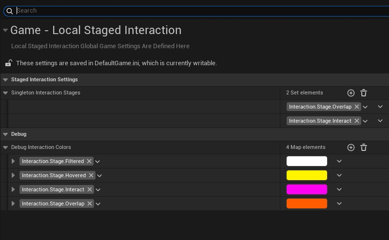

# Project Settings And Debugging

## Project Settings

You can find the `Local Staged Interaction` settings under `Project Settings -> Game -> Local Staged Interaction`.

* **Singleton Interaction Stages:** Are the stages that only one component can have at a time. If another this tags gets added to a new component, previos component will lose it's tag. This is managed my `Local Staged Interaction Manager` Local Player Subsystem.

* **Debug Interaction Colors:** Are the unique colors that can be defined per interaction stage while on the debugging view.

## Debugging

Use console command `LocalStagedInteraction.DebugView` command to toggle activation of the debugging view. In this view you will be able to see which actor has which interaction stages by looking at them. Also all the stages that are active on the world will be printed out on the left of the screen.

:::tip
`LocalStagedInteraction.DebugView 1` to activate.

`LocalStagedInteraction.DebugView 0` to deactivate.
:::