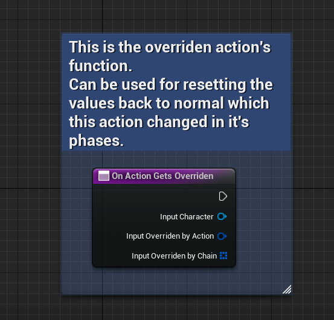

# How To Create And Use Actions

This tutorial will include *Data Assets*. Which you don' t know already you can check out from [Unreal Engine Documentation About Data Assets](https://dev.epicgames.com/documentation/en-us/unreal-engine/data-assets-in-unreal-engine?application_version=5.2).

## Creating the First Action
Every Action Blueprint Data Asset we create is from **MAS-Action-Base**. Start by creating a child of this blueprint. 
The blueprint you created should broadly define the Action it is representing. 

For Ex: name could be *BP_Action_Attack*. Because of this is an *Attack*, *Light Attack*, *Heavy Attack* could be an instance of this blueprint. All you have to do in these instances is, change the *Decide Montage*, and other variables public to this action. And all the default values, and functions will work inside in this BP, with the values you populated in the instances.

After you have created ideally you should override the 2 functions named **OnActionPhaseUpdated** and **OnActionGetsOverriden**.

### On Action Phase Updated

With this function you have access to these inputs:

- **Input Character**: The character who is performing this action.
- **Input Action Chain Updated**: The chain is being played.
- **Input Playing Montage**: The current montage selected for the action.
- **Input New Action Phase**: The newly switched action phase (*Initial*, *Main*, *Closure*, *None*(*Finished*))

With these inputs, you can change, update, anythink you want about the world since you know everthing about the Action, the Character.

### On Action Gets Overriden

With this function you have access to these inputs:

- **Input Character**: The character who was performing this action.
- **Input Overriden by Action**: Newly action got the current action's place.
- **Input Overriden by Chain**: Newly chain got the current action's place.

Perfect place to resetting back to the defaults. 

If you are making a combo for example: Because you know the overriden by action, you may not reset back to the defaults if the overriden by action and current action has the same tag. A Quick way to create combo system.

## Action Instance Data Asset Preview

Let's look at a gameready asset to be used as a *Overhead Light Attack* Action, which is a child of *Action_Attack*.

The combat section is created by *Action_Attack* so your custom variables will look in these instances too.

### Default Action Variables

- **Can Not Be Canceled Duration**: The duration that, when this action gets started to play, it wont get canceled even if more prior actions are in the queue.
- **Priority**: You can define priority per phase. The Action System Component will look for the most prior action in the queue from newly added to latter added. And if the queue has a prior action (in this case system will look for its *Initial* priority) than the current action's phase priority, queued action will be played.
- **Gameplay Attributes** This is just a empty Data Asset. Which you may want to hold some of your global variables regarding to the Action. To use in the functions: "On Action Phase Updated" and "On Action Gets Overriden".
- **Montage Decider** This will decide the montage of the action. We will go in detail about this data asset in the next part.

