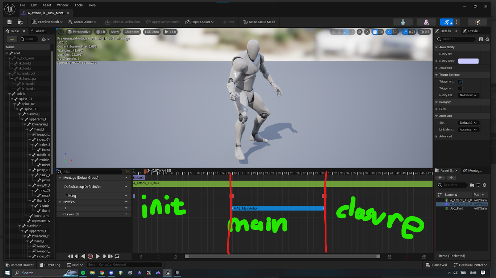

# Anim Notify States To Your Montages

This will determine the *Action Phases* of your actions which plays this montage.

Basicly add **MAS_Main_Action** [Anim State](https://docs.unrealengine.com/4.27/en-US/AnimatingObjects/SkeletalMeshAnimation/Sequences/Notifies/) to your [animation montages](https://docs.unrealengine.com/4.26/en-US/AnimatingObjects/SkeletalMeshAnimation/AnimMontage/).

Let's see how does it work with my increadable drawing skills.

:::note
There is an [Animation Modifier](https://docs.unrealengine.com/4.26/en-US/AnimatingObjects/SkeletalMeshAnimation/AnimModifiers/) which adds this **MAS_Main_Action** anim state to the selected time frames. With these your montages could have a determined time to change their phases.

And by editing this **MAS_AnimNotifyStatePlacer** or it's children all the animations edited by this animaiton modifier change. So it is nondestructive workflow for your montages.
:::