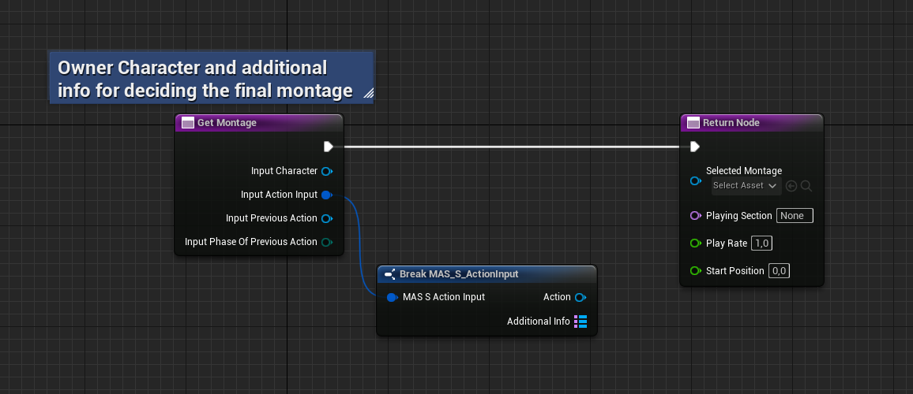

# How To Create And Use Decide Montages? 

 

As actions they have a parent blueprint too. All the Decide Montage Assets should be be a child of **MAS_DecideMontage_Base**.

Start by creating a child blueprint of this blueprint. After that give it a name that expains what does it do like *DM_Attack**.

If you take a look at this blueprint you will see that there is nothing but the `GetMontage` function. Which is correct. It is your responsibility to give in the correct montage to this function by overring this function in the functions panel.

Start by creating a montage variable, so that you can change the value per instance. Additionally you can hold this montage variable inside lists or arrays to your needs.

After this, create a instnace of this data asset that you just created. Name it more specific like *DM_Attack_Swing* and change the default value.

That is it! Now you can populate this `Montage Decider` of your related **Action**. And whenever that action gets called, your provided action will be played.

## Decide Montage Function

As said this is the bread and butter of this asset.

### Inputs

- **Input Character:** The character who tries plays the action. Generally this is the source of the selecting the correct montage.
- **Input Action Input:** Whenever an action input gets added to the queue, this input gets asked, so that you will have a access here. `Action` is the Action Data assets that called this `GetMontage`. Additional Info is just a name and object list, so that you have additional variables to work with.
- **Input Previous Action:** The previous action that got played before the action that called this DecideMontage asset. (Good for double tap input actions or basic combo systems etc).
- **Input Phase of Previous Action:** The action phase that previos action got overriden.

### Outputs

 Outputs are the same inputs of default Unreal Engine Node **[Play Montage](https://docs.unrealengine.com/4.26/en-US/BlueprintAPI/Animation/Montage/PlayMontage/)**.

:::tip

`Play Rate` could be useful for playing montages at different speed according to the relevant character's attributes or equipment.

:::