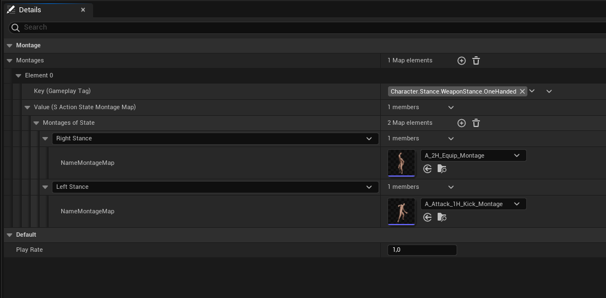

# What Are Decide Montages In MAS?

As the name explains, this assets will determine the action's montages. Every action has a variable called `Montage Decider`. The variable needs to be populated by this Blueprint Data Asset's Instances. Your action will try to get the montage by calling this asset's **GetMontage** function. If no montage is provided, action will be invalid. If a montage is provided action will play that montage. By using this logic can have a basic *Ability System*. 

## Decide Montage Asset Responsibilities 

 

Main responsibility is *obvious enough* proivde the correct montage according to the character.

Generally you want to create this logic as modular as possible. So it is recommended to use *parent-child relation* for the Blueprints of this data asset. So that some actions could be the same for different characters for example (this means that the Montage Decider is the same, but in the function **DecideMontage** returned montage could change to the character).

Combo Systems, State Systems etc. all provided here. But all variables in data asset's are global. So you need to hold related variables in your character's and read them in this asset. 

:::tip
To benefit from Unreal Engine's nested visualision of `Lists` your variables inside **Decide Montage Assets** could be lists.

So that you could have a visualision like this:

It makes editing per Instnace so much easier!
:::
