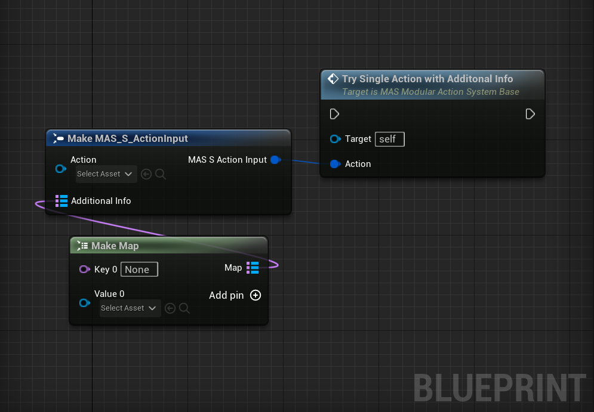

# How To Use MAS?

After you have created [Action](/docs/Modular-Action-System/Actions/) and [Decide Montage](/docs/Modular-Action-System/Decide%20Montages/WhatAreDecideMontages) assets, you are ready to use MAS!

You could create a child of **MAS_ModularActionSystemBase** [Actor Component](https://docs.unrealengine.com/4.27/en-US/ProgrammingAndScripting/ProgrammingWithCPP/UnrealArchitecture/Actors/Components/) or use the actor component directly.

Add this component to your character and you are good to go!

# How to Give Inputs To The Characters?

Ideally you want to give inputs to the characters in [Controllers](https://docs.unrealengine.com/4.26/en-US/InteractiveExperiences/Framework/Controller/). This could be in your [AI_Controllers](https://docs.unrealengine.com/4.26/en-US/InteractiveExperiences/Framework/Controller/AIController/) or your [Player_Controllers](https://docs.unrealengine.com/4.26/en-US/InteractiveExperiences/Framework/Controller/AIController/). 

Where do you want to give this inputs, it is for you to decide but essantially MAS only knows 4 input type which are functions inside **MAS_ModularActionSystemBase**.

## Input Functions

:::note

There is an interface called `MAS_ActionBaseInterface` included with MAS. Which makes clearer to work with actions in your controllers. You just give the `Controlled Pawn` as target in your controller BP and add the same inputs there without getting the component of your character every time.

In your character implement this interface and add the interface inputs to the component inputs.

:::

### Single Action Input

Just a `Action Base` instance reference from your project with no additional info.

### Try Chain Action

Array of `Action Base` instances as reference from your project with no additional info. To be played as a *Chain*.

### Try Single Action With Additional Info

`Action Base` instance reference from your project with additional info. Additional info is just a map of `name` as key and `object` as value. So that `Decide Montage` has this additonal info for more customization.

### Try Chain Action With Additional Info

Array of `Action Base` instances as reference from your project with additional info. Additional info is just a map of `name` as key and `object` as value. So that `Decide Montage` has this additonal info for more customization.

## Debug UI Widget Component

After you are playing with MAS, you may need to debug action priority, queued actions, action chains etc.

This debug view will allow you to see what is going on in the MAS component.

Be free to change the size of the widget.

## Queue System

Queue system is a stack. Last input will be the first one to be interacted. System will try to play the highest priority (initial phase priority) action in the queue.

## Chain System

Chains are usefull for playing the actions related to each other (eg. hold item -> add to invnetory or getArrow -> drawBow -> ReleaseBow). If you want to be sure that what is the previous action, you can get that info at the actions or decide montages. 
As  far as the system concerned, all action are chains. So system will try to play the next action in the chain first if not interrupted.

## Settings

There are settings in the **MAS_ModularActionSystemBase** actor component which you can change per component.

- **ActionQueueCheckType:** If `contionous` selected, system will try check the queue and chain with given `CheckExpiredActions_CheckFrequency`. If `Event Based` selected, system will check the queue and chain whenever new action gets added the queue, or the current action's phase changed. 
- **QueueDuration**: Determines how long the action (or Chain) is in the queue. When the duration gets reached, item gets removed from the queue.
