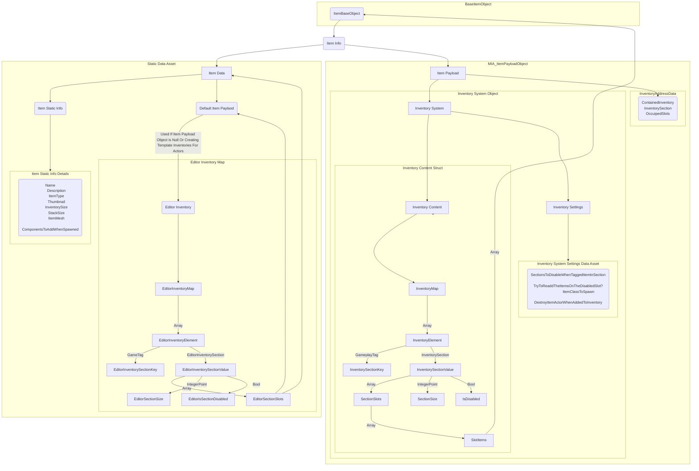

# About Inventory Attachment

```mermaid
flowchart TD
    subgraph BaseItemObject
        ItemBaseObject(ItemBaseObject)
    end

    ItemInfo(Item Info)
    

    subgraph ItemStaticDataObject[Static Data Asset]
        ItemData[Item Data]
        ItemStaticInfo(Item Static Info)
        DefaultItemPayload(Default Item Paylaod)
        EditorInventory(Editor Inventory)

        ItemData -->ItemStaticInfo
        ItemData -->DefaultItemPayload

        subgraph ItemStaticInfoGraph[Item Static Info Details]
            StaticInfoDetail(Name
            Description
            ItemType
            Thumbnail
            InventorySize
            StackSize
            ItemMesh
            ComponentsToAddWhenSpawned
            )
        end

        subgraph EditorInventoryGraph[Editor Inventory Map]
            direction TB
            EditorInventory-->EditorInventoryMap
            EditorInventoryMap-->|Array|EditorInventoryElement
            EditorInventoryElement-->|GameTag|EditorInventorySectionKey
            EditorInventoryElement-->|EditorInventorySection|EditorInventorySectionValue
            EditorInventorySectionValue-->|Array|EditorSectionSlots
            EditorInventorySectionValue-->|IntegerPoint|EditorSectionSize
            EditorInventorySectionValue-->|Bool|EditorIsSectionDisabled
            
            
        end
        ItemStaticInfo --> ItemStaticInfoGraph
        DefaultItemPayload -->|Used If Item Payload Object is Null Or Creating Template Inventories For Actors| EditorInventory
        EditorSectionSlots-->ItemData
    end
    EditorSectionSlots-->DefaultItemPayload

    subgraph ItemPayloadObject[MIA_ItemPayloadObject]
        ItemPayload[Item Payload]
        

        subgraph InventoryAddressGraph[InventoryAddressData]
            InventoryAddress(
            ContainedInventory
            InventorySection
            OccuipedSlots
            )
        end

        subgraph InventorySystemGraph[Inventory System Object]
            InventorySystem[Inventory System]
            InventoryContent[Inventory Content]
            
            subgraph InventoryContentStruct[Inventory Content Struct]
                direction TB
                InventoryContent-->InventoryMap
                InventoryMap -->|Array| InventoryElement
                InventoryElement -->|GameplayTag| InventorySectionKey
                InventoryElement -->|InventorySection| InventorySectionValue
                InventorySectionValue -->|Array| SectionSlots
                InventorySectionValue -->|IntegerPoint| SectionSize
                InventorySectionValue -->|Bool| IsDisabled
                SectionSlots-->|Array|SlotItems
                SlotItems-->|Array|ItemBaseObject
            end
            InventorySettings[Inventory Settings]
            subgraph InventorySystemSettingsGraph[Inventory System Settings Data Asset]
                InventorySettingsDataAsset(
                    SectionsToDisableWhenTaggedItemInSection
                    TryToReaddTheItemsOnTheDisabledSlot?
                    ItemClassToSpawn
                    DestroyItemActorWhenAddedToInventory
                )
            end

            InventorySystem-->InventoryContent
            InventoryContent-->InventoryContentStruct
            InventorySystem-->InventorySettings
            InventorySettings-->InventorySystemSettingsGraph
 
        end

        ItemPayload-->InventorySystem
        


    end

    ItemPayload-->InventoryAddress
    ItemBaseObject --> ItemInfo
    ItemInfo --> ItemData
    ItemInfo --> ItemPayload
    


```