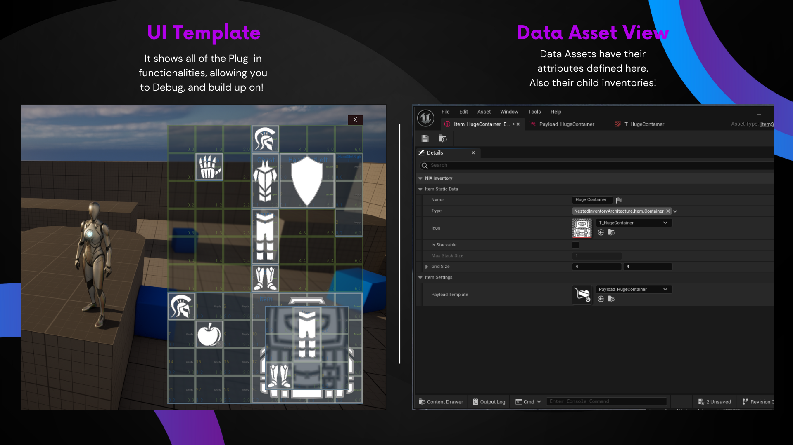

# About Nested Inventory Architecture

**Nested Inventory Architecture** (abbreviated as **NIA**) will allow your players to create and interact with inventories intuitively and easily with the help of *Nested Inventory*, *Object Based*, *Section Based* approach with customizable architecture!

**Docs: [Documentation](https://elmarathstudio.netlify.app/)**

## This System Gives You:

 - **Nested Inventory System** will allow items to hold other inventories! Backpacks within packpacks, weapon attachments inside weapons... Everything is possible!

 - **Object Based Architecture** is makes possible to make use of inheritance for primitive item types and hold runtime variables for items. Everthing that a object can do.

 - **[Data Asset](https://dev.epicgames.com/documentation/en-us/unreal-engine/data-assets-in-unreal-engine) Use For Base Info** Allows items to hold customized variables per class with the help of inheritance and many other advantages of using data assets.

 - **Sections as [GameplayTags](https://docs.unrealengine.com/4.27/en-US/ProgrammingAndScripting/Tags/)** used for Inventories the hold sections with different types. Allowing item transform in a much more intiuative manner. Allowing logics like: *If item tag and section tag matches* etc.
- **Customizable Inventory Editing** is aloways avalible by overriding the releted methods, blueprint or c++!

