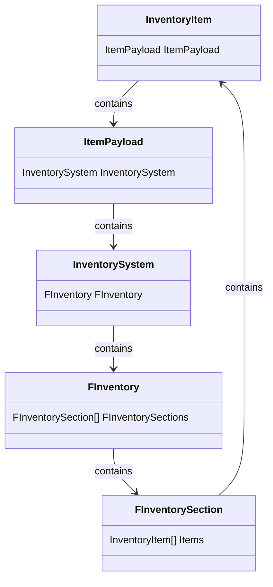

# Inventory Item Object

The object that is responsible to represent items without physical representation in the world.

They can behave based on it's `Static Data` and hold variables inside its `Payload` to effect gameplay.

Creating childs of this class is **not recommended** because system will create the base class of the object with its functions, and you have already overridable classes for more customization.

## Holded Properties in Inventory Item

| Property | Type | Description |
| --- | --- | --- |
| Item Static Data | `UItemStaticData` | The static values of the item that will not change during runtime. Responsible for holding the base values of item apperance, behaviour in enviroments etc. Also holds `Payload Template` inside to create sub inventories and more.  |
| Item Payload |`UInventoryItemPayload` | The values which can change at runtime are hold here for any type of gameplay logic. 
| Item Addresss | `FItemAddress` | The inventory address of the item. Can be invalidated by making a new struct and updating it item is living outside of the inventory. 

## The Looping Architecture of Holding Sub Inventories Inside Items

The following diagram hopefully makes a bit clearer how the each object get carried. 

:::tip
When you need the spawn actors from items, you can just pass the `Inventory Item Object` for the created actor. Than spawn the item from the values holded in the `Item Static Data`, update it's values when the `payload` changes etc.
When these created actors need to be added to inventories, you can just pass the `inventory item object` without needing to construct a new item. 

By the way if you want to construct a new item, the most easy way to do this is calling : `CreateInventoryItemFromStaticData` from the plug-in's function library.
:::