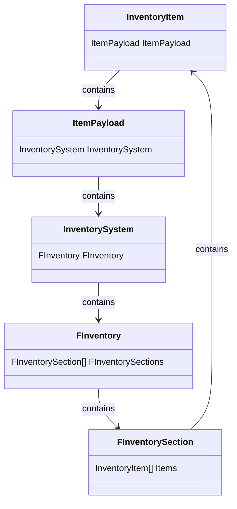

# Object Hierarchy And Their Uses

There are 3 class objects which are used for representing the item: *UInvnetoryItem*, *UItemPayload*, *UInventorySystem*. They are all childs of *UNestedInventoryArchitectureBaseObject* to handle **InventoryManager**, therefore their replication.

*UInventoryItem* holds the *UItemPayload* and *UItemPayload* holds the *UInventorySystem* to hold the item's sub inventory.

### The Looping Architecture of Holding Sub Inventories Inside Items

The following diagram hopefully makes a bit clearer how the each object get carried. **There are no limits** to hold containers within containers.

## Inventory Item Object

The object that is responsible to represent items without physical representation in the world.

They can behave based on it's `Static Data` and hold variables inside its `Payload` to effect gameplay.

Creating childs of this class is **not recommended** because system will create the base class of the object with its functions, and you have already overridable classes for more customization.

### Holded Properties in Inventory Item

| Property | Type | Description |
| --- | --- | --- |
| Item Static Data | `UItemStaticData` | The static values of the item that will not change during runtime. Responsible for holding the base values of item apperance, behaviour in enviroments etc. Also holds `Payload Template` inside to create sub inventories and more.  |
| Item Payload |`UInventoryItemPayload` | The values which can change at runtime are hold here for any type of gameplay logic. 
| Item Addresss | `FItemAddress` | The inventory address of the item. Can be invalidated by making a new struct and updating it item is living outside of the inventory. 

:::tip
When you need the spawn actors from items, you can just pass the `Inventory Item Object` for the created actor. Than spawn the item from the values holded in the `Item Static Data`, update it's values when the `payload` changes etc.
When these created actors need to be added to inventories, you can just pass the `inventory item object` without needing to construct a new item. 

By the way if you want to construct a new item, the most easy way to do this is calling : `CreateInventoryItemFromStaticData` from the plug-in's function library.
:::

## Inventory Item Payload Object

Responsible for holding the inventory system and variables that can changed at runtime. Can be overriden.

To use the overriden class, select the class in the **Payload Template Data Asset**. Whenever that template used to create items, selected class will be created for the item.

## Inventory System Object

Responsible for handling the inventory system and its operations, such as transferring items, discarding items, and adding items.
It also provides the strategy functions for the inventory system to be overridden by the user to customize the behavior of the inventory system. 

To use to overriden class go to your **Project Settings**, under the **Plugins** section and search for **Nested Inventory Architecture**. In there you can select that class that will be used whenever a *Inventory System* gets created. After that whenever a function call is made, your custom code will get run.

#### Blueprint exposed functions are listed below:

| Function Name | Parameters | Return | Description |
| --- | --- | --- | --- |
| `Server_SetInventory` | `const FInventory& New_Inventory` | void | Sets the inventory for the inventory system and replicates it. Automatically updates attributes: Slot Occupation, Item Addresses, ParentInventorySystem. |
| `Server_TransferSlotToSlot` | `const FSlotAddressWithSystem& SourceSlotAddress, const FSlotAddressWithSystem& DestinationSlotAddress` | void | Transfers items from one slot to another. |
| `Server_TransferItemOfCountToSlot` | `const FSlotAddressWithSystem& SourceSlotAddress, const FSlotAddressWithSystem& DestinationSlotAddress, int32 Count` | void | Transfers a specific count of items from one slot to another. |
| `Server_DiscardSlotFromInventory` | `const FSlotAddressWithSystem& SlotAddress` | void | Discards the slot from the inventory. |
| `Server_AddItemsToInventory` | `const TArray<UInventoryItem*>& ItemsToAdd` | void | Adds items to the inventory. |
| `Server_SetInventorySlot` | `const FSlotAddressWithSystem& SlotAddress, const TArray<UInventoryItem*>& ItemsToAdd` | void | Sets the slot of the inventory. |
| `Strategy_TransferSlotToSlot` | `FSlotAddressWithSystem SourceSlotAddress, FSlotAddressWithSystem DestinationSlotAddress, bool bUseForTest` | `ETransferType` | Transfers items from one slot to another and updates them both. Overridable. |
| `Strategy_TransferItemOfCountToSlot` | `FSlotAddressWithSystem SourceSlotAddress, FSlotAddressWithSystem DestinationSlotAddress, int32 Count, bool bUseForTest` | `ETransferType` | Transfers a specific count of items from one slot to another and updates them both. Overridable. |
| `Strategy_DiscardSlotFromInventory` | `FInventory& InventoryToUpdate, FSlotAddressWithSystem SlotAddress` | bool | Discards the slot from the inventory and updates the inventory. Overridable. |
| `Strategy_AddItemsToInventory` | `const TArray<UInventoryItem*>& ItemsToAdd` | `TArray<UInventoryItem*>` | Adds items to the inventory and updates the inventory. Overridable. |
| `Strategy_SetInventorySlot` | `FInventory& InventoryToUpdate, FSlotAddressWithSystem SlotAddress, const TArray<UInventoryItem*>& ItemsToAdd` | bool | Sets the slot of the inventory and updates the inventory. Overridable. |