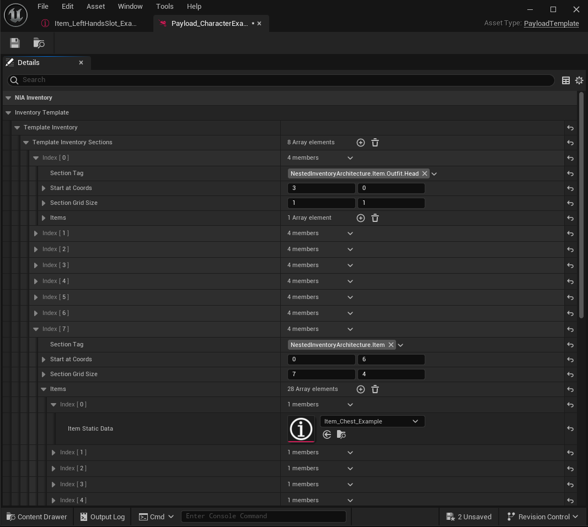

# Payload Template Data Asset

This asset type's main objective is to initialize item's payload object to initialize by giving it a template for the object's initial values. 

They can be:
- Values can change at runtime (Rustyness, condition, wetness  etc.)
- Sub invnetory system of the item.

By default it only creates the sub invnetory. By giving you a virtual inventory view that holds **Item Static Data** instead of the actual objects.

## Default Payload Template Data Asset

| Property | Type | Description |
| --- | --- | --- |
| Inventory Template | `FTemplateInventory` | Main Struct for actual inventory struct to be created. |
| Template Inventory Sections | `FTemplateInventorySection` | Holds the relevant data for the section that will be actually created. |
| Section Tag | `GameplayTag` | Type of the section. Will be relevant for if and item of type can enter the section. | 
| Start At Coords | `FIntPoint` | **Optional** It is used in Template Inventory for creating section at selected coords from top left of the section. Other inventory types may not need this.
| Section Grid Size | `FIntPoint` | The inventory size of the section. When editing Items array will be resized automatically by the result of `x * y`, but holding the values previously exists. 
| Items| `ItemStaticData = []` | The array that will create the initial items of the inventory. Indexes are used for where the item will be created (at which index, it is visible at template inventory and `GetDebugStringFromInventory`). If overlapping items are found, it will be logged in the *Output Log* of the editor. 

:::tip
Sections in the inventory, could be think of like [`maps`](https://docs.unrealengine.com/4.26/en-US/ProgrammingAndScripting/Blueprints/BP_HowTo/WorkingWithMaps/) but they are not. There can more than one section with the same tag in one inventory, and they can be replicated unlike `maps`. But other than that, you can `find` the sections with tag, `add` a section or change its content like in `maps`.
:::