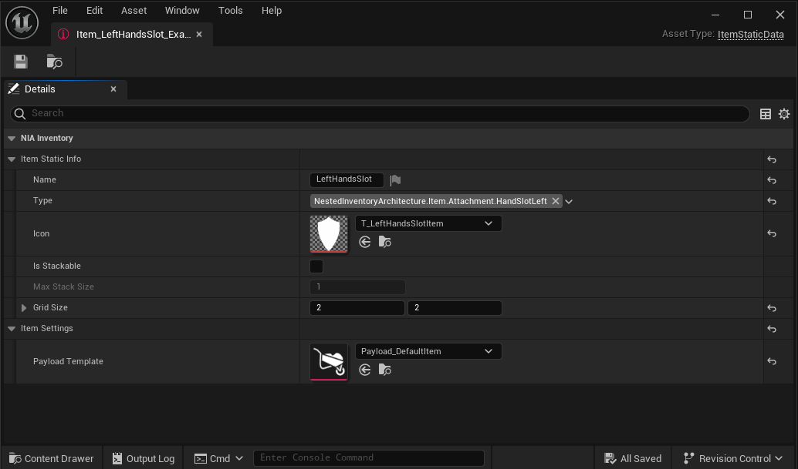
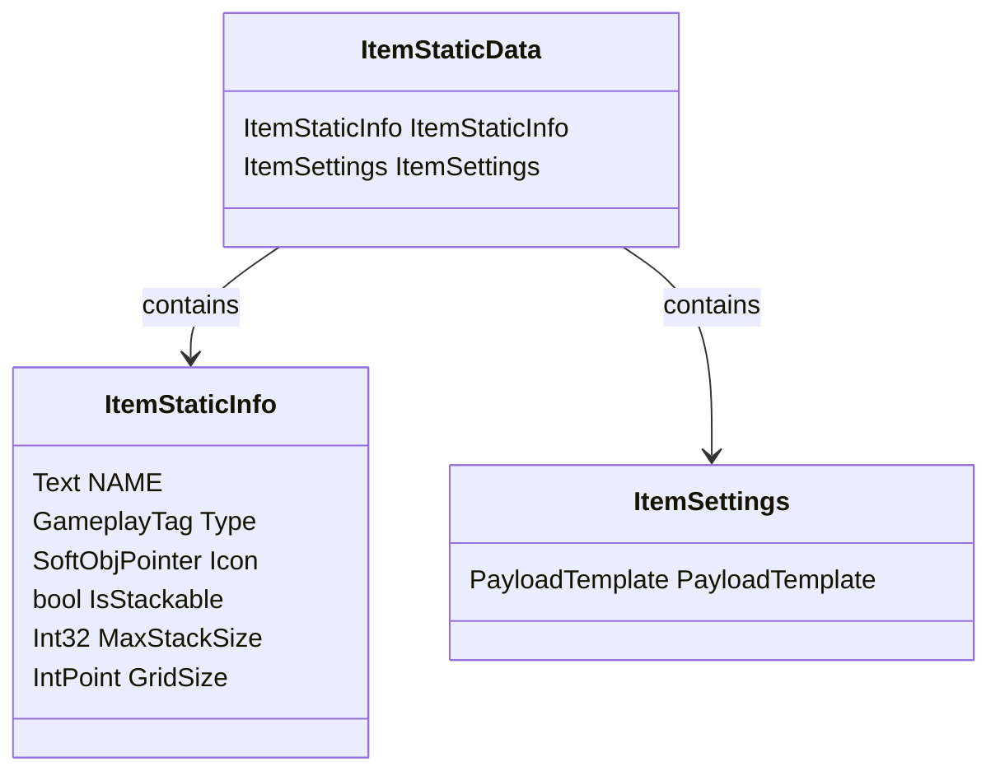

# Item Static Data Asset 

Every item are constructed from a [data asset](https://dev.epicgames.com/documentation/en-us/unreal-engine/data-assets-in-unreal-engine), it's appearence (both in inventory and in game) and all relevant attributes which are static, is holded here. Such as: Mesh, weight, base price etc.

### Using Inheritance in Data Assets
You can create new Data Asset Blueprints which your item instances could will from. For example a weapon class should hold its basic damage values, but armor items should hold its armor stats.

This way you can create a clean the data structre by only showing items relevant info, structure assets based on inheritance hierarchy, easily make changes via [Property Matrix](https://docs.unrealengine.com/4.27/en-US/Basics/UI/PropertyMatrix/) or make use [Editor Utilities](https://docs.unrealengine.com/4.26/en-US/InteractiveExperiences/UMG/UserGuide/EditorUtilityWidgets/) (which plug-in has some built in) while editing.

## Default NIA Item Data Asset
By default NIA only provides the attributes that are nececarry for the inventory system to work. Giving developers the maximum flexibility to work with. 

## ItemStaticData

`ItemStaticData` is a class that contains the following properties:

- `ItemStaticInfo`: An instance of the `ItemStaticInfo` class that contains information about the item.
- `ItemSettings`: An instance of the `ItemSettings` class that contains settings for the item.

### ItemStaticInfo

`ItemStaticInfo` is a struct that contains the following properties:

| Property | Type | Description |
| --- | --- | --- |
| Name | Text | The name of the item. By default it is used for showing tooltips when mouse hovers around items at template inventory. |
| Type | GameplayTag | The type of the item. Used for checking if the item could enter a section. For example Sections are A: Item B:Item.Armor C: Item.Weapon, Item Type is: Item.Armor.Helmet: Item can enter A and B but not C. For more info check [Gameplay Tags](https://docs.unrealengine.com/4.27/en-US/ProgrammingAndScripting/Tags/) |
| Icon | `SoftObjPointer<Texture>` | The icon of the item. Used in template inventory icons. |
| IsStackable | bool | Whether the item is stackable. |
| MaxStackSize | Int32 | The maximum stack size of the item.|
| GridSize | IntPoint | The grid size of the item. For the size of it takes in the inventory.|

### ItemSettings

`ItemSettings` is a struct that contains the following properties:

| Property | Type | Description |
| --- | --- | --- |
| PayloadTemplate | PayloadTemplate | Every item payload can be created from a template, by doing so setting it's inventory structure, initial inventory items etc. And/Or payload's initial values. By default it creates item's sub inventory.|