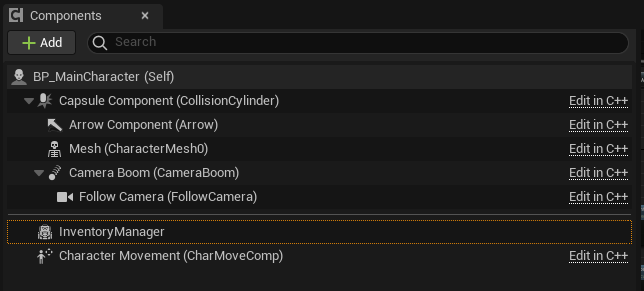
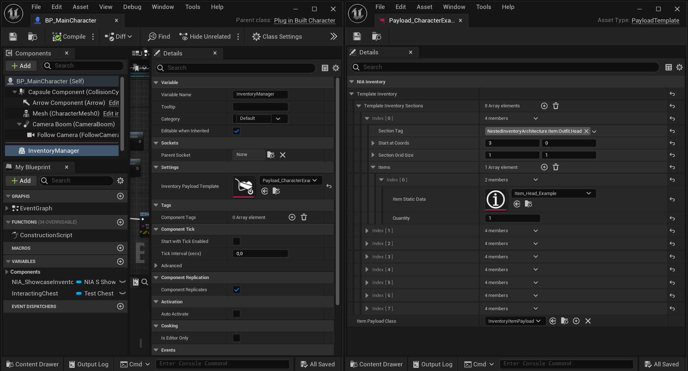
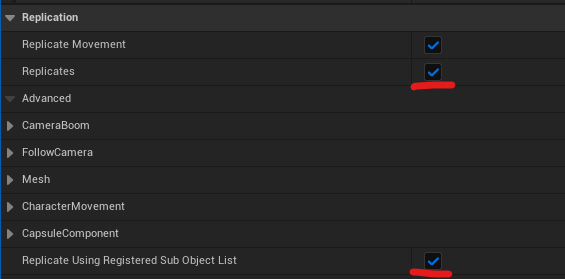
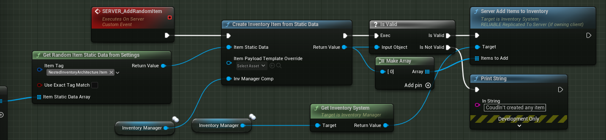
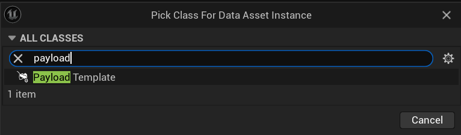
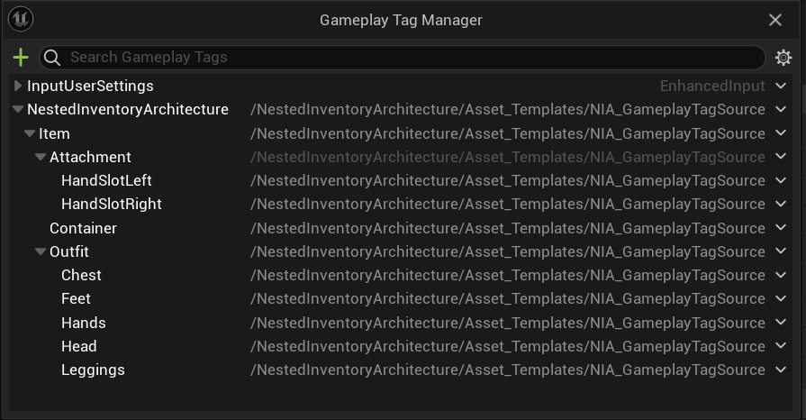
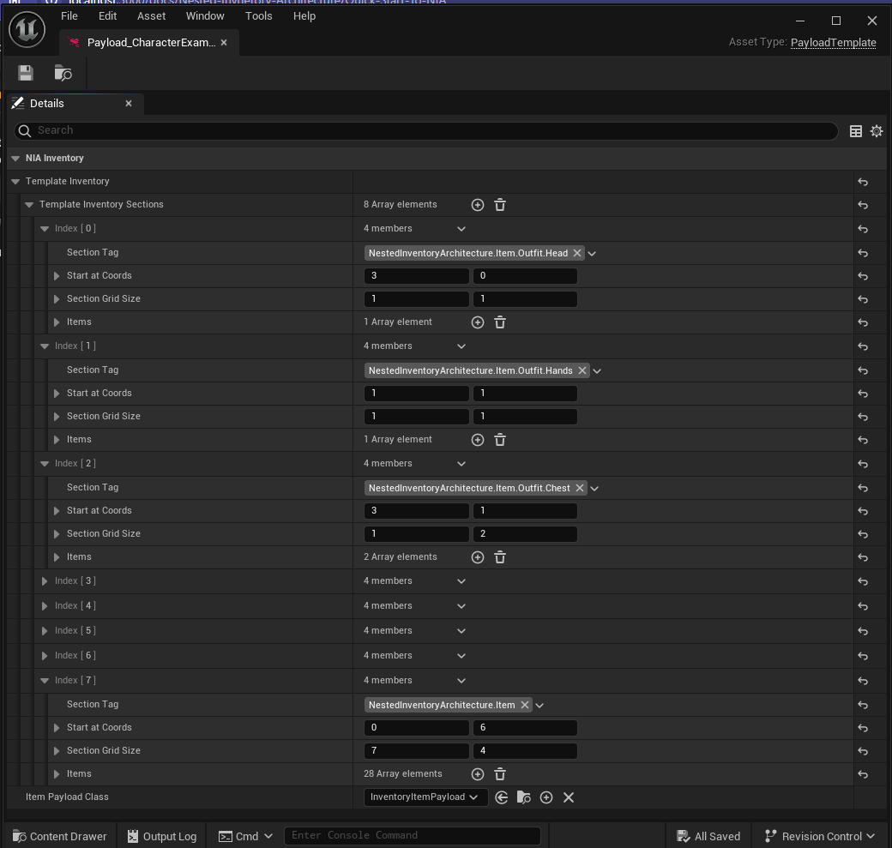
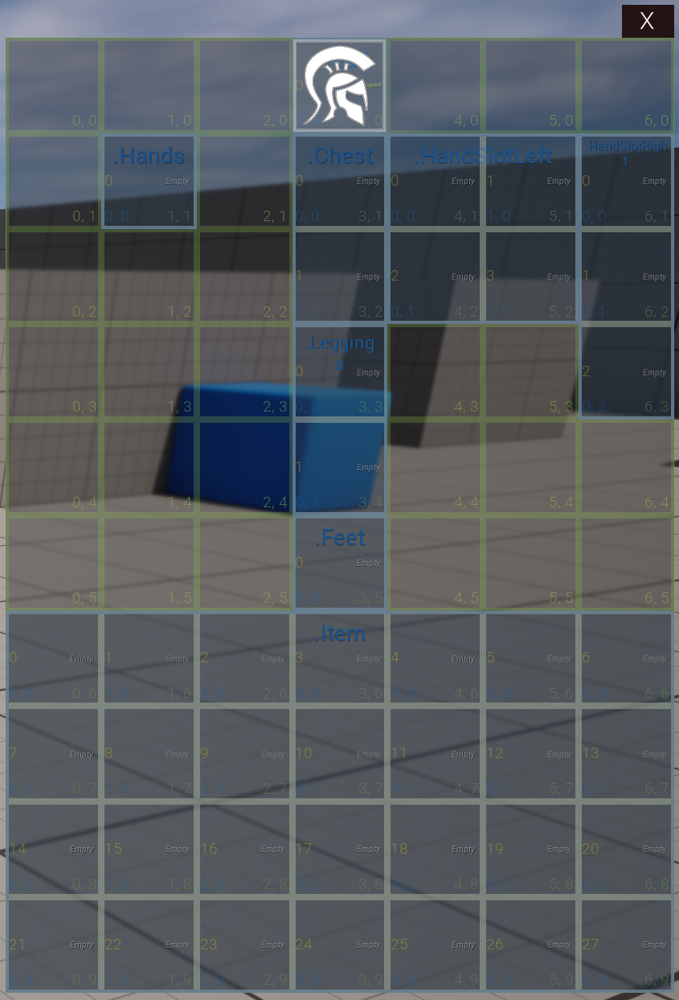
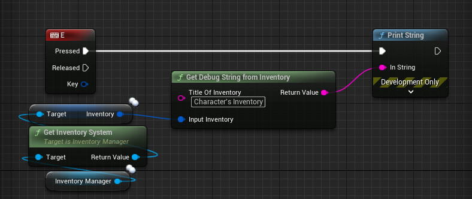
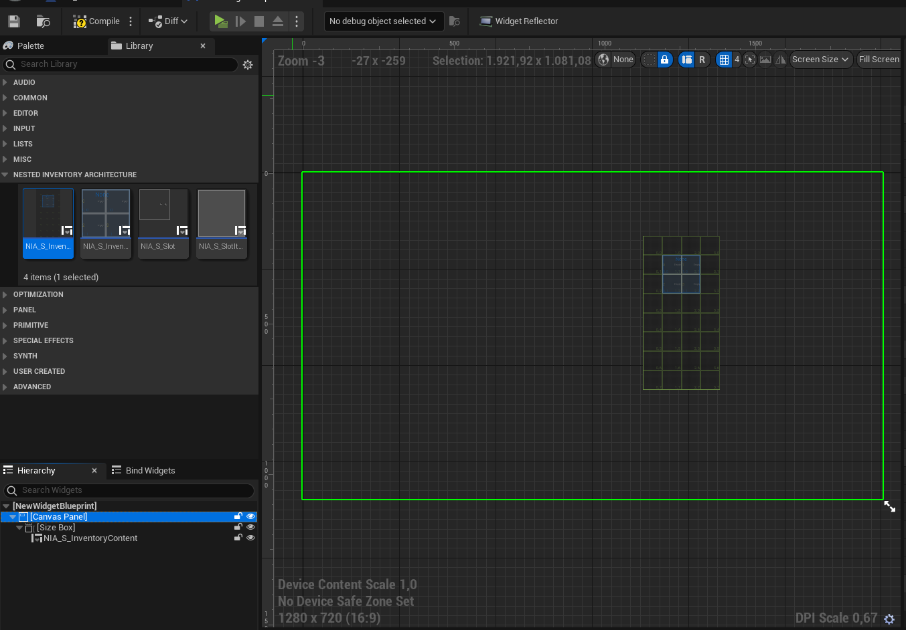

# Quick Start

There a few quick steps that we need to do in order to use NIA. This section will summurize that and give you a quick overview.

## Inventory Manager Component

This is the component that we need to attach to our actors (Generally *Characters*, *Chests*, *Item Actors* etc.) who want to use an inventory and edit it. 

This component creates a **inventory item** at begin play, therefor a **Item Payload** and therefor a **Inventory System**. Inventory System is the system that handles the all inventory system logic (holding the inventory, getting slots etc.). You can quickly access **Inventory System** through *GetInventorySystem* method in the compononent.

Other than creating the inventory system object at initialization, this component's main responsibility is to *Manage* the sub objects's *outer* and *Replication*.

### 1) Add **Inventory Manager Component** to Your Character

In Blueprints it will look like this:

### 2) Select a Default **Payload Template** for the Component
This asset will initialize the character's inventory with given sections.

:::note
For replication, you should make sure that in the **Class Defaults**, **Replicates** and **Replicate Using Registered Sub Object List** options are check true in the Actor that Inventory Manager Component is attached to.

This will allow the inventory objects to use RPC's and replicate variables through *Inventory Manager Component*.
:::

:::note
Replication logic is not different for creating new objects. You have to use a server side function to create new inventory items in your runtime logics.

:::

## Create Your Inventory Template

To create your own Inventory Template Instance, Right click on the *Content Browser*, Go to *Miscellaneous* than *Data Asset*. Search for *Inventory Template* and select.

### 1) Gameplay Tags as Sections

Inventories are consists of sections which are determined by [Gameplay Tags](https://docs.unrealengine.com/4.27/en-US/ProgrammingAndScripting/Tags/). 

This tags are used in both the items and the sections. You should populate your project Gameplay Tags in order to differentiate your items. Such as: 

 *ItemType.Outfit.Helmet, ItemType.Container.Backpack, ItemType.WeaponAttachments.Scope etc.*

:::tip
To copy this gameplay tags architecture, add *NIA_GameplayTagSource* to the Gameplay Tag Table List.
:::

### 2) Organize Your Template

Populate your inventory template for your character as you wish.

An Example:

Example's In World view:

After this you are ready to Use NIA! To determine if your inventory is working you could call the *GetDebugStringFromInventory* and provide your inventory, than print it.

## Create Your Inventory Widget

You are free to use any UI you want with this architecture. If you want to use the NIA's template, create a new *User Widget*, add a *Container* to hold the *Inventory Content Widget*. And create *Inventory Content Widget* and add to this container in your **Graph** by providing the *Inventory System* that the widget is based to (Generally your character's Inventory Manager's inventory system).

After this you can add your own logic to handle inventory widget UI.