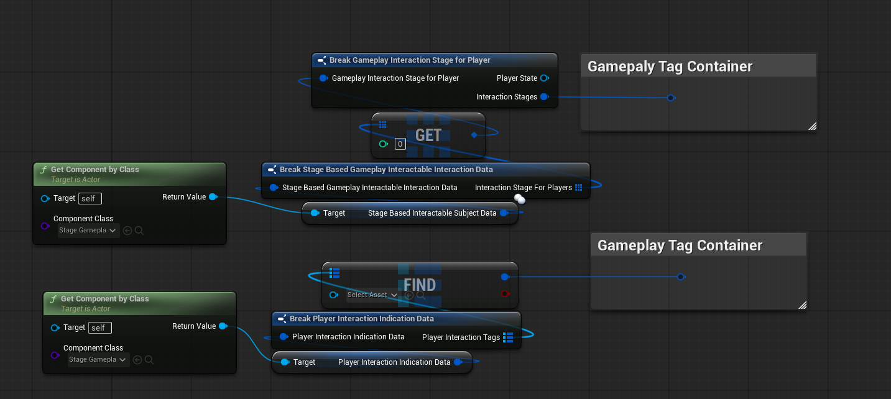
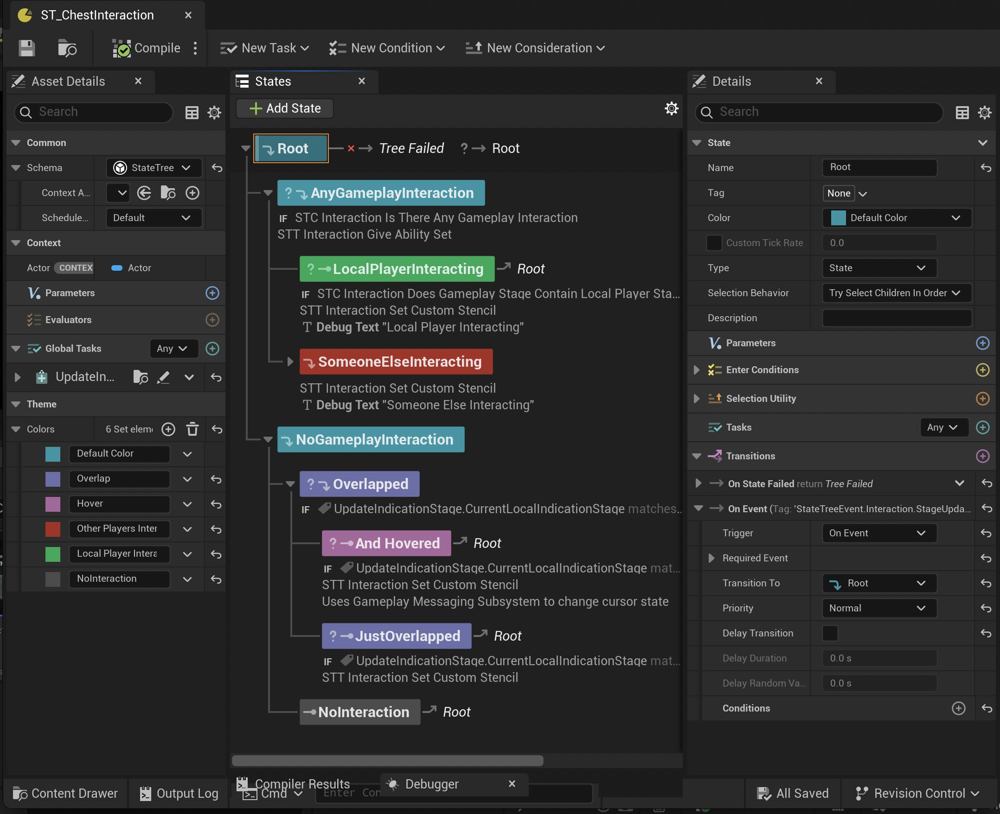
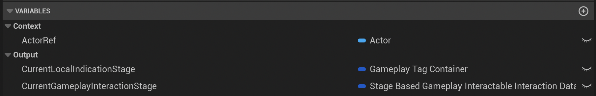
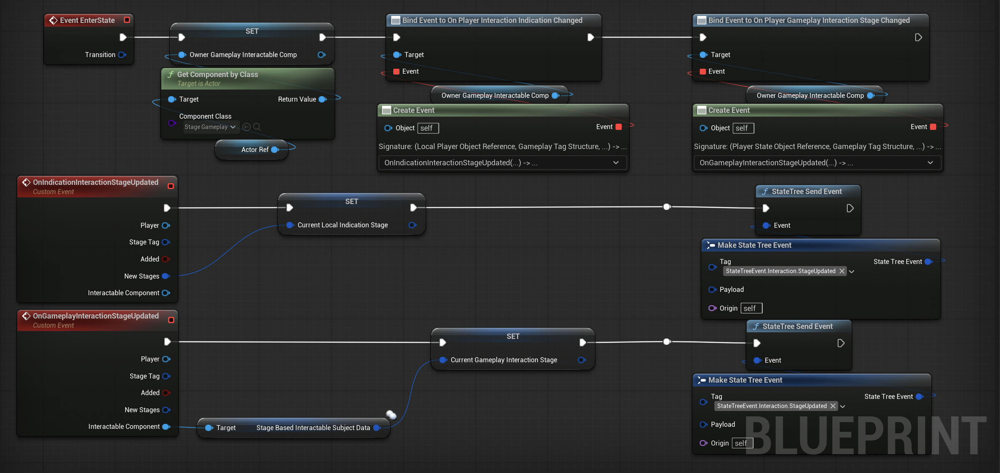
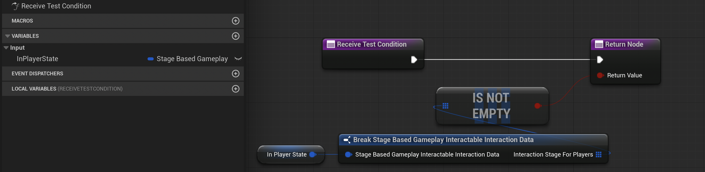
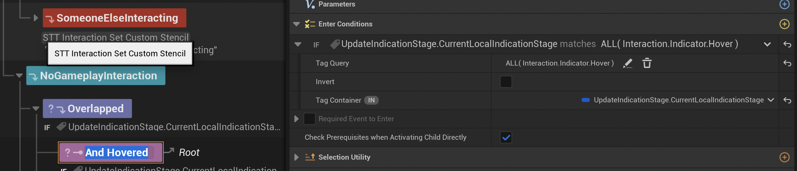
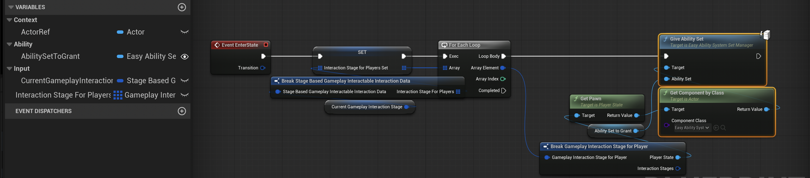
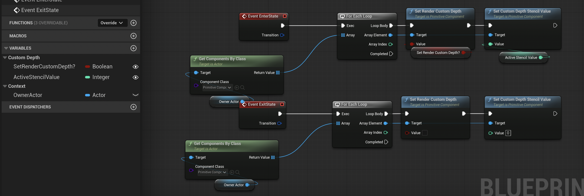
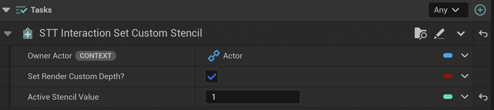

# Handing the Interaction Results

Now that we know how we add our interaction stages to the interactables, we now ready to use the runtime stage information to effect our game world.

As said in the **Setup**, you can use the *On Player Gameplay Interaction Stage Changed* or *On Player Indication Indication Changed* events on the *Stage Gameplay Interactable* to handle these interactions in blueprints. If so you can create a nested if-else conditions to handle each case of the interaction. 

Such as: 

- Is Player Near?

- Is Player Looking at the Actor?

- Is Someone else interacting?

This is completely achievable using the delegates and the current states of the *gameplay* and *indication* stages. But if your interaction system is a complex or multiplayer, this can be hard to manage.

*Data Structure of Stages that are holded per interactor.*

## State Trees For Handling Interaction Stages

Instead of using if else statements, I recommend you to use [State Trees](https://dev.epicgames.com/documentation/en-us/unreal-engine/state-tree-in-unreal-engine) to handle the stage updates. State trees can be added to any Actor and has a clear view of nested conditions. Which is perfect match for this framework.

:::tip Video Showcase
If you want to see a working example of implementing a state tree for stage interaction system, please check out this [Overview Video](https://youtu.be/N_uTlWtp7rg?si=3kOuyNfDsfCJCaPx) of this plugin.
:::

### Showcase

This showcase will try to explain the use case of a *State Tree* for handling Interactions.

*Interaction handling example of a Lootable Chest*

#### Keypoints

* Create a State Tree with *State Tree Actor Component* schema.

* Attach a *State Tree Actor Component* to your interactable actor.

* Create a *State Tree Task* named *STT_UpdateInteractionStageData*.

* In the *STT_UpdateInteractionStageData* create an *Actor* variable inside the *Context* so we can get the interactable reference. And create two variables under *Output* category: *Current Local Interaction Stage* as `FGameplayTag` and *Current Gameplay Interaction Stage* as `FStageBasedGameplayInteractableInteractionData`.

* Then get your interactable actor on the `Event Enter State` and bind interaction update events like following. Than send a `State Tree Event` whenever an interaction event happens.

* On your State Tree's `Global Tasks` add the Task that we have created and make sure that variables are correctly referenced.

* On the `Root State`'s Transition, add an *Event Transition* and set it's required event tag with the same tag that you have defined on your global task and set the `Transition To` `Root`. This way whenever an Interaction Stage gets updated, State Tree will reevalute itself.

Then you are set! You can create your custom `State Tree Conditions` and `State Tree Tasks` to handle your interaction stages. I will show you my State Tree Conditions and few State Tree Tasks so it may give your few more ideas.

---

#### State Tree Conditions

**Is There Any Gameplay Interaction?**

**Does Container Matches Query**

This is an Unreal Engine's build-in condition actually.

There are few other conditions but I belive you got the idea. After you have the actual *Interaction Stage* structs, you are able to create any type of condition on your state trees!

---

#### State Tree Interaction Tasks

In here you activate actors, add outlines, grant-activate abilities on your instigators etc. Both gameplay and indication interactions can be achieved here.

**Give Ability Set To Interactors**

This example is very game specific but it demonstrates that you can get the *Interactors* and do stuff with them whenever they interact.

**Set The Interactable's Custom Depth Stencil Value**

This a good example to demonstrate why you should make your tasks modular. It is very easy to bind stencil value's to integers so that your different *States* can use the same tasks but with different values.

In this example I use my stencil values to create outlines around my interactables with different colors based on the stencil value.

---

I believe that is it for the examples. As you can see this part is very game dependent. I think that this the most fun, optimized, modular way to create interaction handling. So I wish you good luck to create your state tree logic!