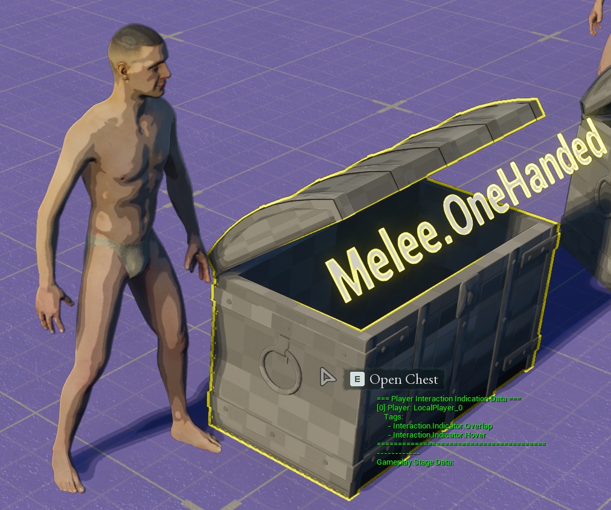
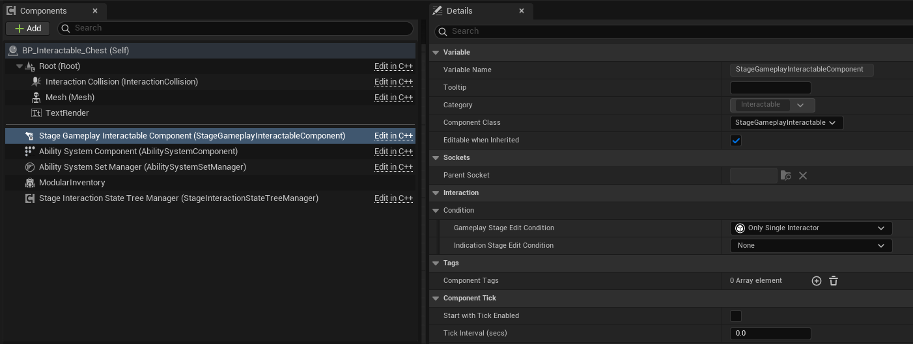
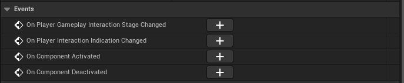
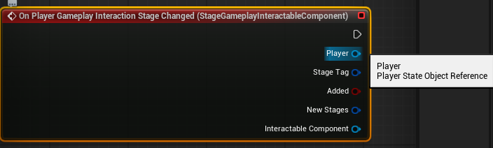
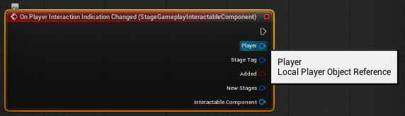
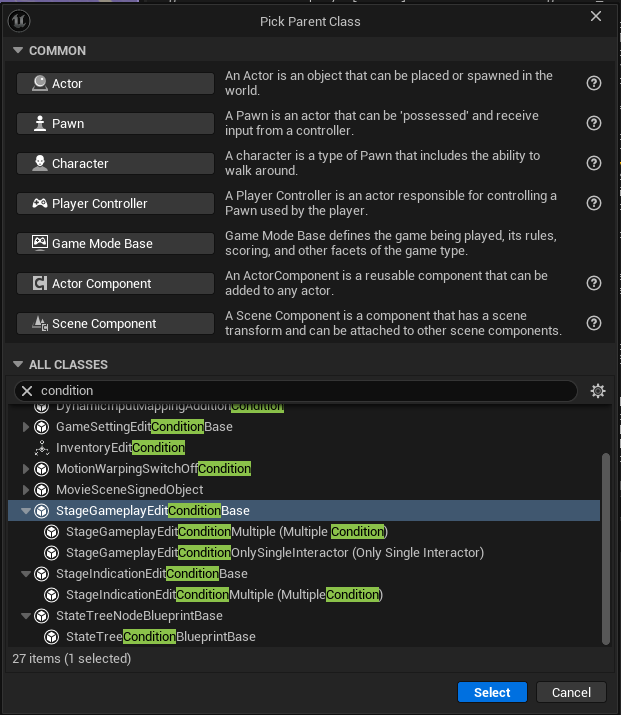
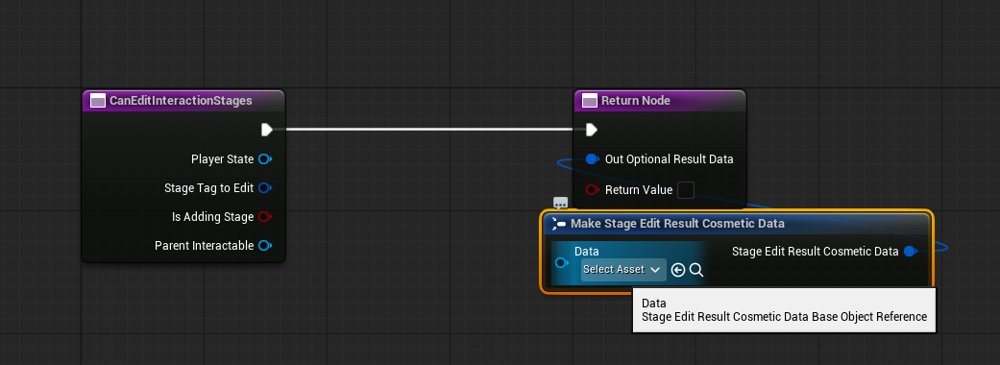
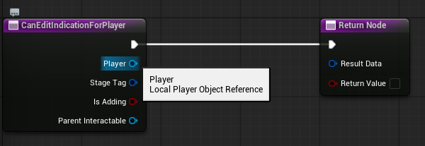
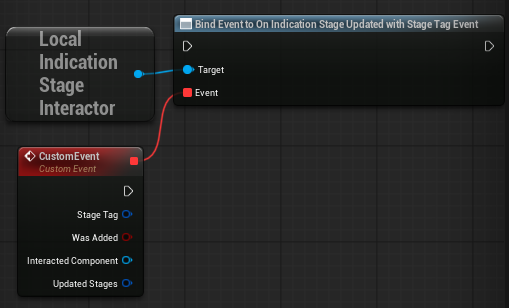
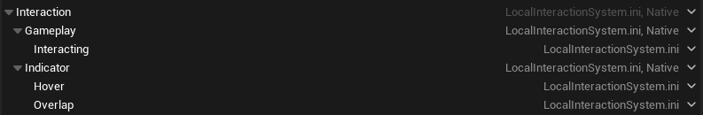

# Setup

Quick start: install the plugin normally (Marketplace, ZIP, or source). If you need help installing plugins, see the official Unreal docs: https://dev.epicgames.com/documentation/en-us/unreal-engine/plugins-in-unreal-engine.

:::tip **Before you start**
Read this short overview so you understand the main concepts: Interactors, Interactables, and Stages.
:::

## Core Concepts

- **Interactors** — controller-related actors that perform interactions (for example: Player State for gameplay stages, or the Local Player controller for indication stages). They track who interacted with what. (Note that AI's can have *Player State*s too!)
- **Interactables** — actors that contain the **StageGameplayInteractable** component. These actors receive stage changes and run the interaction logic.
- **Stage (Interaction Stage)** — a named interaction step (e.g., hover, overlap, open door). Stages are represented by Gameplay Tags so you can customize them per project.

## How it Works?

1. Define stages as Gameplay Tags.
2. Add stage tags to Interactables when those interaction states are valid.
3. Interactors read and act on the Interactable's current stages. (They have the full picture of interactions)
4. The system stores interaction results per Interactor so each player/AI has an independent view of the interaction state. 

## Why use Stages?

- Clear separation between visual indication (hover/outline) and gameplay logic (open/activate).
- Supports multi-user scenarios and prevents conflicts when several actors try to interact with the same object.
- Fully customizable — use Blueprints, State Trees, or C++.

:::tip **Gameplay & Indication Stage Difference**
**Gameplay Stages** are the stages that effect the gameplay. They are replicated and will be the same across all players. Such as *Openning A Door*, *Activating a Lift* etc.

**Indication Stages** are the local stages that are generally responsible of visual effects. Such as *creating an outline whenever an item gets hovered*, or *display a widget that says "Press E to Interact"* etc. Every local player has their own *Indication Stage* for the same actor.
:::

---

## Setting up Interactables

Add the **StageGameplayInteractable** component to any actor your pawns should interact with (C++ or Blueprints).

Steps:

1. Select the actor in the editor.
2. Add the `StageGameplayInteractable` component.
3. Configure initial stages (optional) and any component properties.

In The *Details* view we have few properties for this component. These are displayed under *Interaction*.

### Event Delegates

In the details panel of *Stage Gameplay Interactable* there are events that will fire whenever the *interaction stages* gets updated.

You *can* use this event on blueprints to handle your interaction results. But a better approach will be shown in the following pages.

#### On Player Gameplay Interaction Stage Changed

Whenever a *Gameplay Interaction* is updated (on all machines (server or clients)), this delegate will fire. This delegate will carry the information about the update.

#### On Player Indication Indication Changed

Whenever a *Indication* stage gets updated this event will fire on the local machine. This delegate will carry the information about the update.

### Conditions (Optional)

*Conditions* for the Interactable objects, controls wheather a *Stage* can *enter* or *exit*. These are classes that are blueprintable. So you can create your own conditions for your specific needs.

Then in the details panel of your *Stage Gameplay Interactable* you can add and customize its variables.

You can use the *Create Blueprints Class* to create them.

#### Gameplay Stage Edit Condition

Controls wheather a *Gameplay Stage* can enter or exit.

When you *override* the *CanEditInteractionStages* function on the created class you can now create your own condition logic.

Below is a concise description of the function parameters and the expected return value. Use this table when documenting or implementing custom edit conditions.

| Parameter | Type | Description |
|-----------|------|-------------|
| `PlayerState` | `APlayerState*` | The player state of the player attempting to edit the interaction stages. Use this to check player-specific permissions, tags or state. |
| `StageTagToEdit` | `const FGameplayTag&` | The Gameplay Tag that identifies the stage being added or removed (for example `Gameplay.Stage.Interact`). |
| `bIsAddingStage` | `bool` | `true` when the stage is being added; `false` when the stage is being removed. Use this to apply different rules for enter vs exit. |
| `OutOptionalResultData` | `FStageEditResultCosmeticData&` | Output parameter. Provide optional cosmetic data (instanced `UStageEditResultCosmeticDataBase`) to communicate a visual result or reason back to the caller (for example a deny tooltip or animation). Leave `Data` null if no cosmetic feedback is needed. |
| `ParentInteractable` | `const UStageGameplayInteractable*` | The interactable object being edited. Use it to inspect the current stages, tags, or component properties for conditional logic. |

Return value:

- The function returns a `bool`: `true` to allow the edit (add/remove the stage), or `false` to prevent it.

#### Indication Stage Edit Condition

It works the same as the *Gameplay Stage Edit Condition*. But it handles *Indication Stages* and uses the [Local Player](https://dev.epicgames.com/documentation/en-us/unreal-engine/API/Runtime/Engine/ULocalPlayer) instead of the [Player State](https://dev.epicgames.com/documentation/en-us/unreal-engine/python-api/class/PlayerState?application_version=5.0).

---

## Seting up Your Interactors (Optional)

By default you actually don't need to do anything to set up your interactors. Interactin system will work. But if you want to get the updates from your interactors too, you can. So that you can follow your interacted objects in your interactors.

:::note **Using Player States on your AI's**
This is a good part to mention this. By default your AI's won't get any *Player State* for them. But unreal has an option to enable *Player States* per AI. This is nececarry if you want your AI's to interact with actors just like the players.

To enable that feature:

- Open up your [AI Controller](https://dev.epicgames.com/documentation/en-us/unreal-engine/ai-controllers-in-unreal-engine).

- In the details panel set *Wants Player State* boolean to true.

This way you can get their *Player State* but just getting the variable called *Player State* on your controllers, so that you can input the correct *Player State* whenever your AI wants to interact with an actor.
:::

### Gameplay Stage Interactor

Open up your **Player State** class and add this component called **Gameplay Stage Interactor**.

With that component attached, you can get the event called **On Interaction Updated With Stage Tag**. So whenever that player state interacts with an actor, this event will fire.

### Local Indication Stage Interactor Subsystem

This is a [Local Subsystem](https://dev.epicgames.com/documentation/en-us/unreal-engine/programming-subsystems-in-unreal-engine) that is linked to your *Local Player*. So whenever a stage gets updated on that *Local Player* this subsystem will know that and fire *On Indication Stage Updated With Stage Tag Event* Delegate. You don't have to do anything do enable this. This is system is already enabled, but if you want to keep track of your locally interacted actors, this is how you do it.

---

## Creating Gameplay Tags For Stages

[Gameplay Tags] are used to create our custom interaction stages. This part will change project to project. So you are free to create your gameplay tags as you want. But there is a parent tags group that is defined natively for our interactions for editing our gameplay tags easier in our data views in editor.

These are:

- **Interaction.Gameplay** for gameplay stages.
- **Interaction.Indicator** for indication stages.

*example:*

---

That is it for the setup. Let's look at how to we can interact!