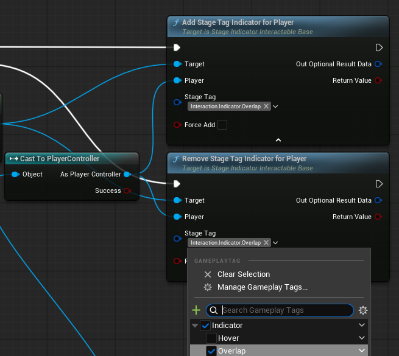
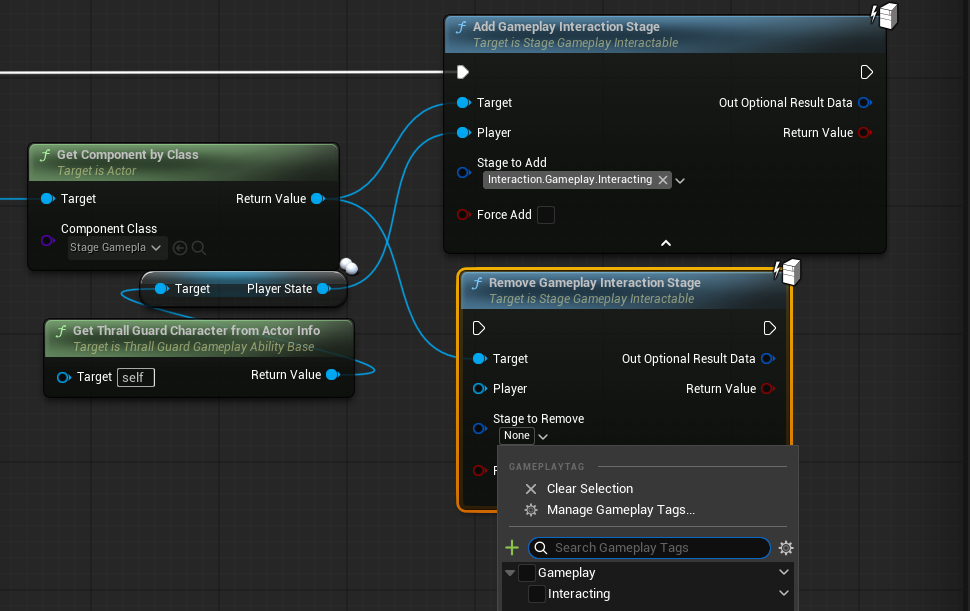

# Using Stage Interaction

After the initial setup, you can add your interaction stages to your interactable actors. You can do this on your characters, abilities, componenents etc.

## Editing Indication Stages

Indication is a *Local* interaction. Meaning we will work with the *Local Player*. In blueprints it is cumbersome to get *Local Player* in a regular class. So for the second best, we use the *Player Controller* to get the *Local Player*.

These are the methods that we are going to use to edit our indication stages on the given interactable component.

- **Add Stage Tag Indicator For Player**

- **Remove Stage Tag Indicator For Player**

In Inputs:

* **Target** is the *Stage Indicator Interactable Base*.
* **Player** is the *Player Controller* which interacts.
* **Stage Tag** is the stage that we add to our interactable.
* **Force Add** is wheather we skip the *conditions* which we defined on the component.

As Outputs:
* **Optional Result Data** is the cosmetic data on the *condition* which is valid if the operation was unsuccesful. Could be used for *Why was this interaction unsuccesful*.
* **Return value** is the boolean that tells us weather this operation was successful.

:::warning
Indications are used for players, not AI's. It is because these interactions for our players to see what is interactable and their interaction state. So they are not related to AI's.
:::
---

## Editing Gameplay Stages

Gameplay stages are the stages that effects the gameplay, *such as openning a door*. Because of this they have to be added on the server (They can be used like any other function in single player games). 

Inputs and outputs are the same as in the *Stage Indication Functions* on the top but the *Player* input. Player input is a *Player State* that can be accessed from any pawn.

---

To get the current stages you can use the *Get Gameplay Stages* or *Get Indication Stages* on the *Stage Gameplay Interactable* component. They are publicly available.