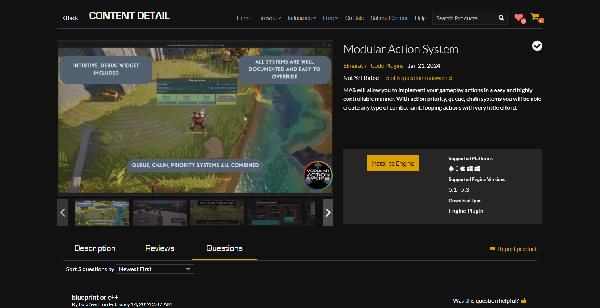

# About Tutorials

All the tutorials will be updated whenever a feature changes in the related Plug-In.

My Personal request from you is to leave a **Review** about this plug-in in the Epic Marketplace. Good or bad (Hopefully good).




## Feedback

You can always hop on the  **[Discord](https://discord.gg/HghXuWHJJx)** to ask questions. 


### All The Plug-ins Aim:

- **Modular Pieces** to be used in every project. To do so, your reviews are really important for this process.
- **Optimization** is always a high priority considiration while designing.
- **Readablility** is always considered for the end user and for the development.

:::note
    **Note For Supported Platforms**

    Most of the projects has win64 has its supported platforms. This is because it is very impractial to test if the plugin does work with every available platform. If you are planning to release your project to different platform, change the releated plugin's `.uplugin` file. Go to the modules and add the supported platform. Plugin files are found in `<EngineFolder>/Plugins/Marketplace/`.
    ``` .json
    "Modules": [
		{
			"Name": "<ModuleName>(ex: AdvancedHitTrailerEditor)",
			"Type": "Runtime",
			"LoadingPhase": "Default",
			"PlatformAllowList": [
				"Win64",
                    // Add your platforms here
			]
		},
		{
			"Name": "<ModuleName>",
			"Type": "Editor",
			"LoadingPhase": "PreDefault",
			"PlatformAllowList": [
				"Win64",
                    // Add your platforms here
			]
		}
	]
    ```
    After this you need to recompile your engine. Or you could copy the plugin folder from the engine files and paste it in your project's plugin folder. If you do not have `Plugins` folder in your project create it with the exact name and paste the copied plugin there. Than just compile the project.

    If you have any issues with the incompatible platform, let us know in the discord!
:::

## What We Expect From You

Plug-ins are not *Started Packs* that you can use from the get go. You should always implement your own logic to create your own system.
For example you need to create child of blueprint classes, or orginize data assets to what your game needs.
So systems needs some work in order to be integreted to your project. *So you need to be familiar with the Engine Default Assets*.

Also if you find any bugs or features missing, you can let us know in the discord.

That's said, Good Luck with your Project!
